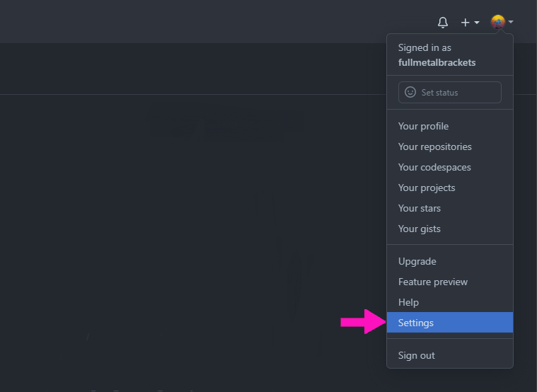
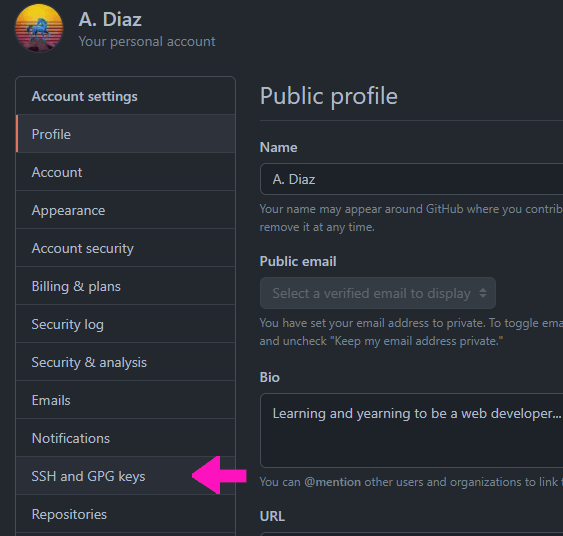
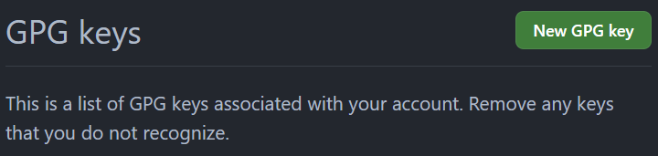
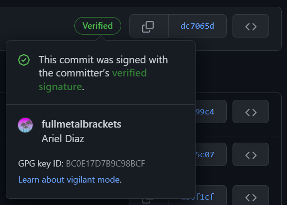

## Sections

1. [Check for an existing GPG key](#check)
2. [Generating a new GPG key](#generate)
3. [Tell git to use your signing key on all commits](#tell)
4. [Add the GPG key to GitHub to get verified](#add)
5. [References](#ref)

> 
>
> **GnuPG** is not available on Windows by default, so if necessary, <a href="https://www.gnupg.org/download" target="_blank">download it here</a> and install it first. It should go without saying you'll need <a href="https://git-scm.com/downloads" target="_blank">Git</a> installed, since you will have to use **Git Bash**.
> 
> On Linux, you will simply be using the Terminal and GnuPG should already be installed, if not use the command `sudo apt install gnupg2 -y` to do so.

<div id='check' />

## Check for an existing GPG key

If in Linux, open up the terminal, or if in Windows open up _Git Bash_, then use the following command:

```shell
gpg --list-secret-keys --keyid-format=long
```

If you already have a GPG key, you should see output like something like this:

```shell
Users/Bob/.gnupg/pubring.kbx
---------------------------------
sec   rsa4096/3AA5C34371567BD2
```

<div id='generate' />

## Generating a new GPG key

> 
>
> To get the verified badge next to your commits on GitHub, you need a verified email address before adding a GPG key. <a href="https://docs.github.com/en/get-started/signing-up-for-github/verifying-your-email-address" target="_blank">See these instructions.</a> Afterwards be sure to tell Git your email address with `git config --global user.email "YOUR_EMAIL"`.

To generate a GPG key (either because you have none or want a new one) use the following command in Terminal for Linux, or Git Bash for Windows:

```shell
gpg --full-generate-key
```

If for some reason you're on an older version of GnuPG, the above command won't work, use this one instead:

```shell
gpg --default-new-key-algo rsa4096 --gen-key
```

After using the command you'll get some prompts, it's strongly suggested to simply use the defaults for _key type_, _key size_ and _expiration_ by hitting <kbd>Enter</kbd> on the first three prompts. One of the prompts will ask for your _email address_, make sure to use your GitHub-verified email address which should also added to your Git config, as stated above.

A final prompt will ask for a password, make sure to pick a secure password that you will remember! You'll need it each time you want to sign a commit when using `git push`.

Once done, check that your new key exists:

```shell
gpg --list-secret-keys --keyid-format=long
/c/Users/Ariel/.gnupg/pubring.kbx
---------------------------------
sec   rsa4096/BC0E17D7B9C98BCF 2022-01-17 [SC]
```

<div id='tell' />

## Tell git to use your signing key on all commits

Open the terminal in Linux, or Git Bash in Windows. If you had previously set up Git to use a different key format, you can unset it and use the default format of `openpgp` with this command:

```shell
git config --global --unset gpg.format
```

To tell git to use the key (I'll use the example key from above), use this command:

```shell
git config --global user.signingkey BC0E17D7B9C98BCF
```

And, though optional, you may want to congigure Git to sign all commits with your new GPG key by default:

```shell
git config --global commit.gpgsign true
```

<div id='add' />

## Add the GPG key to GitHub to get verified

To get the verified badge on commits, we need to add the GPG key on GitHub. Click on your _Profile_ picture and then choose _Settings_ from the dropdown.



Next click on **SSH and GPG keys** in the menu on the left:



Scroll down to where it says _GPG keys_ and click on the **New GPG key** button.



To see the portion of the GPG key you need to add in GitHub, use this command:

```shell
$ gpg --armor --export BC0E17D7B9C98BCF
```

You'll get a wall of text as output, copy and paste from `-----BEGIN PGP PUBLIC KEY BLOCK-----` to `-----END PGP PUBLIC KEY BLOCK-----` and all the text in-between. _Make sure to include those opening and ending comment lines!!_ You'll then need to confirm the new key by providing your GitHub password.

Now to test it out, push out any commit to a GitHub repo. You should be prompted for the GPG password when using `git commit` and providing it will sign the commit. Now your commits should have the verified badge in GitHub.



<div id='ref' />

## Reference

- <a href="https://docs.github.com/en/authentication/managing-commit-signature-verification" target="_blank">GitHub Docs</a>
- <a href="https://www.gnupg.org/download" target="_blank">GnuPG</a>
- <a href="https://git-scm.com/downloads" target="_blank">Git</a>
