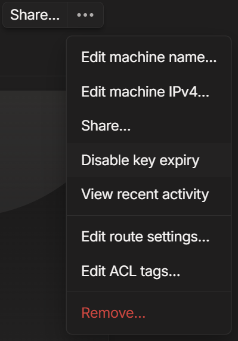
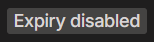
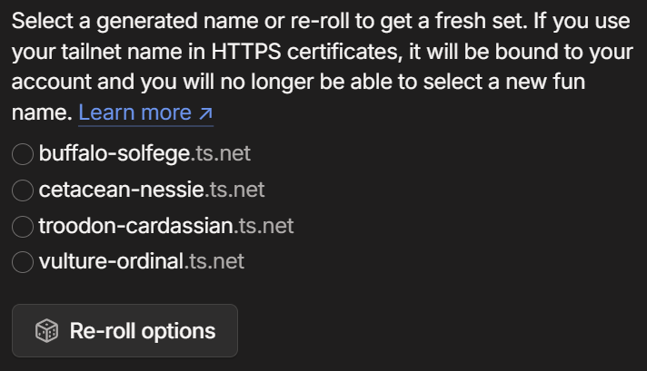
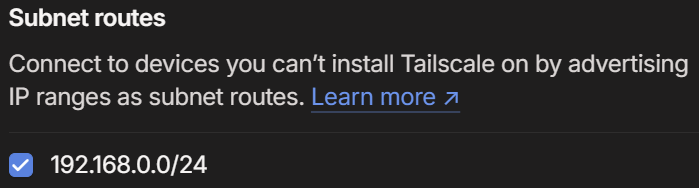
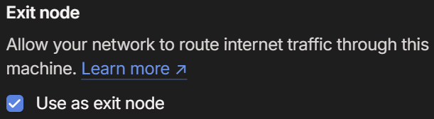
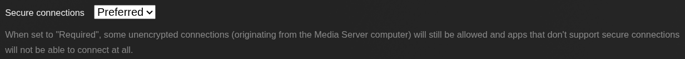
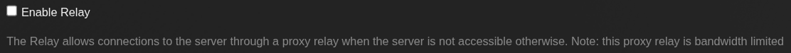
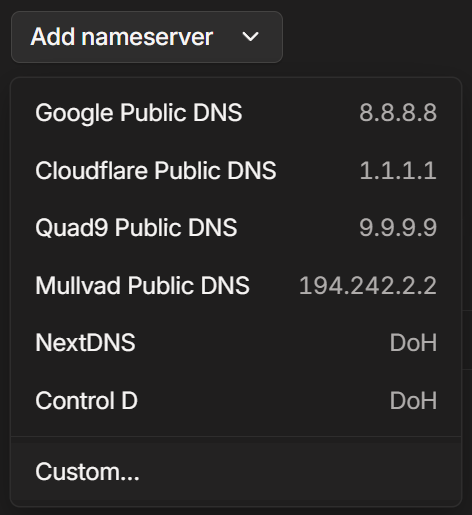
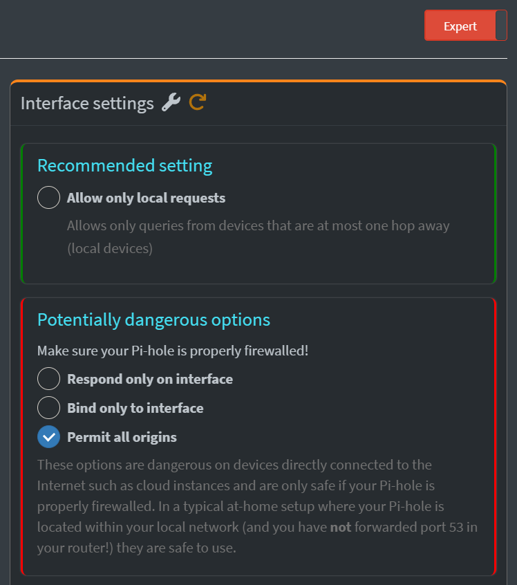

## About Tailscale

Tailscale lets you set up a mesh virtual private network (VPN) for secure access to devices and self-hosted services on your home network from anywhere using the Wireguard protocol. An overlay network known as a Tailnet is created that all devices running Tailscale will join, with traffic between devices going through an encrypted Wireguard tunnel and using NAT traversal, without the need to open ports on your router.

The personal plan is free, allows three users and up to 100 devices. I use it mainly to access Plex on my home server (though I can access all my self-hosted apps) and use my Pi-Hole as DNS through my phone, tablet and laptop when I'm not home, and that is what this guide will help you do. For details, <a href="https://tailscale.com/blog/how-tailscale-works" target="_blank" data-umami-event="tailscale-post-docs-how">see this post on the Tailscale blog about how it works</a>.

To be clear, _Tailscale is itself not self-hosted_ and relies on Tailscale's own relay servers (what they call <a href="https://tailscale.com/kb/1232/derp-servers" target="_blank" data-umami-event="tailscale-post-docs-derp">Designated Encrypted Relay for Packets or DERP</a>) when direct connections are not possible. Also, it is important to know that everything in Tailscale is open source _except_ the <a href="https://tailscale.com/blog/how-tailscale-works#the-control-plane-key-exchange-and-coordination" target="_blank" data-umami-event="tailscale-post-docs-how-control">control server</a>, which manages communication between tailnet nodes by exchanging Wireguard public keys, assigning IP addresses, and coordinating secure peer-to-peer connections between devices. (The GUI clients for Windows and macOS are also closed source, which makes sense since those two operating systems are also closed source.)

There is an <a href="https://github.com/juanfont/headscale" target="_blank" data-umami-event="tailscale-post-headscale">open source implementation of the control server called Headscale</a>, however I have not used it and have no plans to, so this artcile will not touch on it.

## Setting up Tailscale

First things first, go to the <a href="https://tailscale.com" target="_blank">Tailscale website</a> and create an account. This will create your <a href="https://tailscale.com/kb/1136/tailnet" target="_blank" data-umami-event="tailscale-post-docs-tailnet">Tailnet</a> (private network for all your Tailscale-connected devices) with your newly created account as the Owner and which you'll manage through the web-based <a href="https://login.tailscale.com/admin" target="_blank" data-umami-event="tailscale-post-admin-console">admin console</a>.

This guide will assume you're running Tailscale on a Linux server, although the instructions also work for Windows WSL 2. (You can also install Tailscale on <a href="https://tailscale.com/kb/1022/install-windows" target="_blank" data-umami-event="tailscale-post-install-windows">Windows</a> and <a href="https://tailscale.com/kb/1016/install-mac" target="_blank" data-umami-event="tailscale-post-install-mac">MacOS</a>.) On your Linux server, use the following command to run the Tailscale install script:

```sh
curl -fsSL https://tailscale.com/install.sh | sh
```

Once it's finished installing, use the command `tailscale up`, go to the provided URL and login to connect the machine to your tailnet. (You'll go through the same quick process for each Linux machine you add to your tailnet.)

> [warning] **Important!**
>
> By default using most Tailscale commands requires superuser privileges, i.e. `sudo`. You can change that with the command `sudo tailscale set --operator=$USER`, the specified user will then be able to execute Tailscale commands without `sudo`.
> 
> The rest of the guide will assume you did this.

Now go to the Tailscale admin console and you should see the machine there. By default all machines added to your tailnet need to re-authenticate every 90 days, which is a nice security measure, but you probably want to disable it at least for those machines that you trust and want to access through Tailscale long-term.

To do so, on the admin console go to the **Machines** tab, click on the three dots to the right of the machine's entry, then from the dropdown menu choose **Disable key expiry**. You'll need to do this for each new machine you add if you don't want to have to re-authenticate later.

:::image-figure[Disabling key expiry for Tailscale node.]

:::

Once done, you'll see a little **expiry disabled** badge under the machine in the admin console.

:::image-figure[Tailscale node showing expiry disabled badge.]

:::

Next we'll set up Tailscale on the phone/tablet, which is as easy as going to the app store, downloading the Tailscale app and opening it, then logging in to your Tailscale account and tapping the **Connect** button. You're basically done now, you can access your server from the phone or tablet, but there's some additional configuration we should do.

## Using a fun tailnet name

By default your **tailnet name**, the subdomain for your Tailnet, is something auto-generated like `tailfe8c.ts.net`. Instead you should generate a "fun name" that is more human-readable.

To get a fun tailnet name, go to the Tailscale console and click the **DNS** tab. Click the **Rename tailnet...** button and follow the prompts. You can keep re-rolling until you find a name you like. You can't just type one in, unfortunately, rather you choose from ones generated by Tailscale.

:::image-figure[Choosing a tailnet fun name.]

:::

For future examples, we'll assume your tailnet name is `cetacean-nessie.ts.net`. Fun little tidbit, if you're wondering at the naming convention, it uses <a href="https://github.com/tailscale/tailscale/blob/main/words/tails.txt" target="_blank">things with tails</a> (e.g. `comet`, `tuna`, `gecko`) for the first word and <a href="https://github.com/tailscale/tailscale/blob/main/words/scales.txt" target="_blank">things with scales</a> (e.g. `dragon`, `musical`, `kitchen`) for the second word. 

## Setting up a subnet router

Technically, you can just install Tailscale on every device on your network and add them to your Tailnet, but that's not necessary. You can instead only install it on one machine and use that as a "subnet router" to access other network resources. This is especially handy for accessing devices that you can't or don't want to run Tailscale on.

First, on the machine you want to use as subnet router, you need to enable IP forwarding. (This is straight from the <a href="https://tailscale.com/kb/1019/subnets" target="_blank" data-umami-event="tailscale-post-docs-subnet">Tailscale docs</a>.)

<div id='ip-forwarding'/>

If your machine has an `/etc/sysctl.d` directory (which most likely it does) then use these commands:

```sh
echo 'net.ipv4.ip_forward = 1' | sudo tee -a /etc/sysctl.d/99-tailscale.conf
echo 'net.ipv6.conf.all.forwarding = 1' | sudo tee -a /etc/sysctl.d/99-tailscale.conf
sudo sysctl -p /etc/sysctl.d/99-tailscale.conf
```

If your machine does NOT have the directory (`ls /etc/sysctl.d` returns `No such file or directory`) then instead use these commands:

```sh
echo 'net.ipv4.ip_forward = 1' | sudo tee -a /etc/sysctl.conf
echo 'net.ipv6.conf.all.forwarding = 1' | sudo tee -a /etc/sysctl.conf
sudo sysctl -p /etc/sysctl.conf
```

You may also get a warning on some systems:

```sh
Warning: UDP GRO forwarding is suboptimally configured on end0, UDP forwarding throughput capability will increase with a configuration change.
See https://tailscale.com/s/ethtool-config-udp-gro
```

You can try to do as the link advises, but I've found that on some systems their instructions to persist changes in `ethtool` do not actually work. Instead, <a href="https://github.com/tailscale/tailscale/issues/14473#issue-2758485605" target="_blank">I found these instructions in the GitHub issues</a> which I tweaked to place the script in `/etc/NetworkManager/dispatcher.d/pre-up.d/50-tailscale` and make it executable, and it works on my Raspberry Pi running Debian Bookworm:

```sh
sudo printf '#!/bin/sh\n\nethtool -K %s rx-udp-gro-forwarding on rx-gro-list off \n' "$(ip -o route get 8.8.8.8 | cut -f 5 -d " ")" | sudo tee /etc/NetworkManager/dispatcher.d/pre-up.d/50-tailscale
sudo chmod 755 /etc/NetworkManager/dispatcher.d/pre-up.d/50-tailscale && sudo chmod +x /etc/NetworkManager/dispatcher.d/pre-up.d/50-tailscale
```

You can then test if this works with the following command:

```sh
sudo /etc/NetworkManager/dispatcher.d/pre-up.d/50-tailscale
test $? -eq 0 || echo 'An error occurred.'
```

Finally, if you're running firewalld on a machine where you've installed Tailscale, you should allow masquerading with the following command:

```sh
sudo firewall-cmd --permanent --add-masquerade
```

Now advertise the subnet routes with this command: (This assumes your local IP addresses are `192.168.0.x`)

```sh
tailscale set --advertise-routes=192.168.0.0/24
```

Now go to the admin console, on the **Machines** tab, and do the following:

1. Click the three dots to the right of the machine want you want to use as subnet router. (Notice the `subnets` tag.)

2. Choose **Edit route settings...** from the dropdown menu.

3. Click the checkbox for **Subnet routes** and click the **Save** button to finish.

:::image-figure[Advertising a subnet range in Tailscale admin console.]

:::

One last thing, if you are running Tailscale on multiple machines in your home network, you should use the command `tailscale set --accept-routes=false` on those other machines, that way they will keep using local routes (e.g. `192.168.0.x`) instead of going through the tailnet -- you don't want to access your local network resources through Tailscale when you're home!

## Setting up an exit node

This is an entirely optional step, but a very cool feature. You can set a machine running Tailscale to function as an _exit node_, so all traffic is route through the machine running as exit node.

This way you can, for example, not only access your home network, but all internet traffic will be routed through your home internet as if you were home, so you also get the advantage of any hardware firewalls and network-wide DNS sinkholes on the network. Another use case could be installing Tailscale on a VPS and using it as an exit node to mask your IP, like a more traditional VPN.

First, if you haven't set up IP forwarding, [as explained above](#ip-forwarding) in the subnet router section, go ahead and do so since this is also required for running an exit node. (If you setup a subnet router on the same machine you will use as exit node, then you already did this and can [skip to the next section](#configuring-plex-for-tailscale).)

Once that's done, use the following command to advertise the machine as an exit node:

```sh
tailscale set --advertise-exit-node
```

Now go to the admin console, on the **Machines** tab, and do the following:

1. Click the three dots to the right of the machine want you want to use as exit node. (Notice the `exit node` tag.)

2. Choose **Edit route settings...** from the dropdown menu.

3. Click the checkbox for **Use as exit node** and click the **Save** button to finish.

:::image-figure[Enabling exit node in Tailscale admin console.]

:::

Finally, to use the exit node on your phone/tablet open the Tailscale app, tap the **Exit Node** button at the top and the server you set as an exit node should appear as an option -- choose it to turn it on.

To use an exit node from a Linux machine, use the following command: (Use the tailnet IP or machine name of your exit node.)

```sh
tailscale set --exit-node=<ip or name>
```

On Windows, click on the Tailscale icon in the system tray, hover over **Exit nodes** and choose your node from the menu.

## Configuring Plex for Tailscale
 
> [warning] **Important!**
>
>  Plex recently put remote access -- whether accessing your own content outside your network OR other users accessing your shared libraries -- behind Plex Pass. I have been told, and also have seen others report on Reddit, that Plex considers Tailscale IPs to be external and thus not allow access unless you have a <a href="https://www.plex.tv/plans/" target="_blank">Plex Pass subscription</a> or the external users have a <a href="https://support.plex.tv/articles/remote-watch-pass-overview/" target="_blank">Remote Watch Pass</a>.
>
> Per <a href="https://www.reddit.com/r/Tailscale/comments/1kes22h/comment/mqpp8l4/" target="_blank">this post on the Tailscale subreddit</a>, it will work if you set up the Plex server as both subnet router and exit node, and set the external device to use the Plex server as exit node. I have a lifetime Plex Pass myself and only use Tailscale to punch through CGNAT, so unfortunately I am unable to test this. (However, I can confirm that with Plex Pass, this works without advertising subnet routes or exit node.) I suggest trying first with subnet router only, as [described above](#setting-up-a-subnet-router) and see if that works -- if it does not, [advertise your server as an exit node](#setting-up-an-exit-node) and set your external device to use it.
>
> Please feel free to [contact me](mailto:contact@fullmetalbrackets.com) and let me know if it does or does not work!

Although you should be able to reach your Plex media server's web UI via browser on your phone or tablet when connecting through Tailscale (and using subnet router/exit node as explained above), the Plex and Plexamp apps will not work until you do the following configuration in the Plex.

On the Plex web UI go to **Settings** -> **Network** and do the following:

1. Set _Secure connections_ to **Preferred**

:::image-figure[Setting secure connections to "Preferred" in Plex Media Server.]

:::

2. Set _Preferred network interface_ to **Any**

3. Make sure _Enable Relays_ is **unchecked**

4. Go to _Custom server access URLs_ and type in the server's tailnet URL with the Plex port, e.g. `https://server.cetacean-nessie.ts.net:32400`

:::image-figure[Disabling the Relay in Plex Media Server.]

:::

5. Click on **Save changes**

## Additional config for SMB and NFS

This is entirely optional, but I like to have access to my SMB shares on my laptop and even on my phone through Solid Explorer or X-plorer. Rarely used, but still handy. Per <a href="https://github.com/tailscale/tailscale/issues/6856#issuecomment-1485385748" target="_blank" data-umami-event="tailscale-post-smb-gh-issue">this issue on GitHub</a> we need to do a little extra config for SMB to work through Tailscale. ([See below for additional NFS config.](#nfs))

First, find out your server's main interface device name with the `ip a` command and pay attention to the output: 

```sh
1: lo: <LOOPBACK,UP,LOWER_UP> mtu 65536 qdisc noqueue state UNKNOWN mode DEFAULT group default qlen 1000
    link/loopback 00:00:00:00:00:00 brd 00:00:00:00:00:00
2: en2sp0: <BROADCAST,MULTICAST,UP,LOWER_UP> mtu 1500 qdisc mq state UP mode DEFAULT group default qlen 1000
    link/ether 6f:cc:a2:e8:72:30 brd ff:ff:ff:ff:ff:ff
```

In the above case, the ethernet interface is called `en2sp0`, but for you it may be called something different like `end0`, `eth0`, etc. (Wi-Fi interfaces are usually `wlan0` or similar.) Notice also the loopback interface named `lo`.

Edit the Samba config file at `/etc/samba/smb.conf` and add the following under `[global]`:

```ini
[global]
interfaces = lo enp2s0
bind interfaces only = yes
smb ports = 445
```

Restart Samba for the config change to take effect:

```sh
sudo systemctl restart smbd.service
```

Finally, we'll use <a href="https://tailscale.com/kb/1312/serve" target="_blank" data-umami-event="tailscale-post-docs-serve">Tailscale Serve</a> to allow the SMB traffic to be routed through Tailscale, using this command:

```sh
tailscale serve --bg --tcp 445 tcp://localhost:445
```

<div id='nfs'/>

To access NFS shares through Tailscale, we need to add the Tailscale IP of the NFS client (the machine that will be accessing the shares) to `/etc/exports`, for example:

```sh
/path/to/share 100.143.11.92(rw,sync,no_subtree_check)
```

## Setting a Pi-Hole as Tailnet DNS

By default, Tailscale does not manage your DNS, and each machine on the Tailnet will use it's own configured DNS settings. Tailscale lets you set a global DNS to be used by all machines when connected to the tailnet, and you can use the public DNS resolvers like Cloudflare or Google.

More importantly, you can also use a custom DNS server, including one self-hosted on a server in your network. In this way, we can <a href="https://tailscale.com/kb/1114/pi-hole" target="_blank" data-umami-event="tailscale-post-docs-pihole-anywhere">use Pi-Hole from anywhere through Tailscale</a>.

First, on the machine running Pi-Hole install Tailscale, login to add it to the tailnet and when prompted to `tailscale up` use with command `tailscale up --accept-dns=false`. (Alternately you can add the option after Tailscale is already up with the command `tailscale set --accept-dns=false`.)

Pi-Hole uses DNS servers configured within Linux as its upstream servers, where it will send DNS queries that it cannot answer on its own. Since you're going to make the Pi-Hole be your DNS server, you don't want Pi-Hole trying to use itself as its own upstream, and the `--accept-dns=false` flag achieves that.

> You should also use the `--accept-dns=false` flag on other machines in your home network running Tailscale, so they don't go through Tailscale for DNS requests.
>
> You want any DNS requests from machines in your local network to stay on your local network, NOT to go through Tailscale, or they'll show up with Tailscale IPs (e.g. `100.90.80.70`) instead of your local network IPs (e.g. `192.168.0.100`). Only remote devices outside of your network should be sending DNS requests to Pi-Hole through the tailnet, and only when connected to Tailscale.

Now to set the Pi-Hole as global DNS for the tailnet, go to the Tailscale admin console and make note of the Pi-Hole's Tailscale IP address in the *Machines* list. Then do the following:

1. Go to the **DNS** tab and scroll down to _Nameservers_.

2. Under _Global nameserver_ click **Add nameserver** and choose **Custom...** from the dropdown menu.

:::image-figure[Adding a custom nameserver in Tailscale admin console.]

:::

3. Enter the Pi-Hole's tailnet IP and click **Save**.

4. Enable the **Override local DNS** toggle.

:::image-figure[Enabling override DNS in Tailscale admin console.]

:::

5. Login to your Pi-Hole's UI and go to _Settings_ -> _DNS_.

6. If using Pi-Hole v6, click on the toggle at the top-right to switch from _Basic_ to _Expert_. (If using Pi-Hole v5 or earlier, this step is unnecessary.)

7. Under _Interface settings_, choose the option **Permit all origins**.

:::image-figure[Setting Pi-Hole interface to permit all origins.]

:::

7. Scroll to the bottom and click **Save* & Apply*.

Now to test it out, connect to Tailscale on your phone/tablet and visit some websites. You should not be seeing ads and should start seeing the device's Tailscale IP in Pi-Hole's logs.
## Transfer files with Taildrop

Taildrop is an Alpha feature that lets you securely transfer files between devices on a tailnet. To enable it, on the admin console go to the **Settings** tab, scroll down to **Feature previews** and switch on **Send Files**.

Transferring files from phones/tablets (whether iOS or Android) is super easy using the **Share** menu, just choose **Tailscale** from the options, then choose a **tailnet machine** to send the file to.

On Windows and MacOS you right-click the file, choose **Share** from the menu, choose **Tailscale** from the option, and then the **tailnet machine**. 

Files received through Taildrop appear in the device's default Downloads folder. (Except on Linux, see below.)

Unfortunately, sending and receiving files on a Linux machine is not as seamless right now, for some reason, but they're working on it. Even on desktop environments there's no Tailscale option when using right-click and Share, so you have to use terminal commands to both send and receive files via Taildrop.

To send from Linux, use the following command: (Be sure to include the colon at the end!)

```sh
tailscale file cp <file> <tailnet-name-or-ip>:
```

Receiving files on Linux also requires a command. Once a file is _sent to_ a Linux machine, it doesn't automatically appear in any directory, instead it goes into a "Taildrop inbox" and has to be fetched.

Use the following command to download any files in the Taildrop inbox: (If you don't specify a directory it will download into the present working directory.)

```sh
tailscale file get /home/$USER/downloads
```

I found <a href="https://davideger.github.io/blog/taildrop_on_linux" target="_blank" data-umami-event="tailscale-post-david-eger-blog-taildrop-script">this blog post by David Eger</a> with a bash script to run a daemon that continuously uses the `tailscale file get <target>`, but under the circumstances I just prefer sending files to my server using <a href="https://localsend.org" target="_blank" data-umami-event="tailscale-post-localsend">LocalSend</a>. To use Taildrop with a NAS -- specifically Synology, QNAP, Unraid or TrueNAS -- <a href="https://tailscale.com/kb/1307/nas" target="_blank" data-umami-event="tailscale-post-docs-nas">see here</a>.

## Further reading

I've only scratched the surface on what Tailscale can do in this post, because all I use it for (so far) is to access my home network from my phone, tablet and laptop when away from home. Here's some recommended reading for additional features not touched on in this post.

- <a href="https://tailscale.com/kb/1271/invite-any-user" target="_blank" data-umami-event="tailscale-post-further-docs-invite">Invite other users to your tailnet</a>
- <a href="https://tailscale.com/kb/1018/acls" target="_blank" data-umami-event="tailscale-post-further-docs-acls">Manage permissions using ACLs</a>
- <a href="https://tailscale.com/kb/1312/serve" target="_blank" data-umami-event="tailscale-post-further-docs-serve">Serve static pages on your tailnet with Tailscale Serve</a>
- <a href="https://tailscale.com/kb/1223/funnel" target="_blank" data-umami-event="tailscale-post-further-docs-funnel">Route traffic to the internet with Tailscale Funnel</a>

## References

- <a href="https://tailscale.com/kb" target="_blank" data-umami-event="tailscale-post-ref-docs">Tailscale Docs</a>
- <a href="https://tailscale.com/kb/1136/tailnet" target="_blank" data-umami-event="tailscale-post-ref-docs-tailnet">Tailnets</a>
- <a href="https://tailscale.com/kb/1019/subnets" target="_blank" data-umami-event="tailscale-post-ref-docs-subnets">Subnet Routers</a>
- <a href="https://tailscale.com/kb/1103/exit-nodes" target="_blank" data-umami-event="tailscale-post-ref-docs-exitnodes">Exit Nodes</a>
- <a href="https://tailscale.com/kb/1081/magicdns" target="_blank" data-umami-event="tailscale-post-ref-docs-magidns">MagicDNS</a>
- <a href="https://tailscale.com/kb/1114/pi-hole" target="_blank" data-umami-event="tailscale-post-ref-docs-pihole">Pi-Hole from anywhere</a>
- <a href="https://tailscale.com/kb/1106/taildrop" target="_blank" data-umami-event="tailscale-post-ref-docs-taildrop">Taildrop</a>