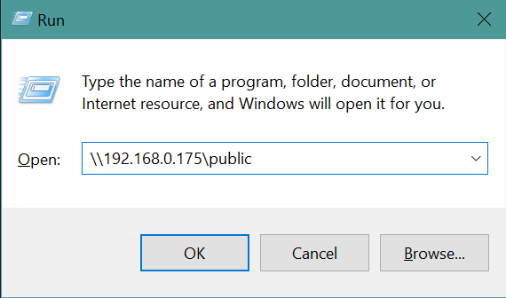

## Sections

1. [Prepare the user and share](#prep)
2. [The configuration file](#config)
3. [References](#ref)

<div id='prep' />

## Prepare the user and share

Create a new user for the share, and give it whatever password you want when prompted, it won't be used to access the share anyway.

```bash
sudo adduser public
```

The folder `/home/public` will be automatically created, we'll be using that as the public share. Let's give everyone full read/write permissions:

```bash
sudo chmod -R ugo+rw /home/public
```

<div id='config' />

## The configuration file

Use this minimal `smb.conf`:

```yaml
[global]
   workgroup = WORKGROUP
   server string = Samba %v %h

# The below should make transfers faster and is optional
   strict allocate = Yes
   allocation roundup size = 4096
   read raw = Yes
   server signing = No
   write raw = Yes
   strict locking = No
   socket options = TCP_NODELAY IPTOS_LOWDELAY SO_RCVBUF=131072 SO_SNDBUF=131072
   min receivefile size = 16384
   use sendfile = Yes
   aio read size = 16384
   aio write size = 16384

[public]
   comment = Public Samba Share
   path = /home/share
   browseable = yes
   writeable = yes
   read only = no
   public = yes
   guest only = yes
   force user = share
   force group = share
   force create mode = 0666
   force directory mode = 0777
```

> 
>
> The parameters before <code>[public]</code> is optional, I found <a href="https://eggplant.pro/blog/faster-samba-smb-cifs-share-performance" target="_blank" rel="noopener noreferrer">this blog post</a> about it and I have definitely noticed it makes transfer speeds a little faster.

Next check that the syntax of the config file is valid:

```bash
testparm
```

If all is good, restart the Samba service for the changes to take effect:

```bash
sudo systemctl smbd nmbd
```

Now you should be able to access the share from a Windows PC on the same network without being prompted for a login.



<div id='ref' />

## Reference

- <a href="https://www.samba.org/samba/docs" target="_blank" rel="noopener noreferrer">Samba Documentation</a>
- <a href="https://eggplant.pro/blog/faster-samba-smb-cifs-share-performance" target="_blank" rel="noopener noreferrer">Eggplant Systems & Design blog post about improving Samba share performance</a>
