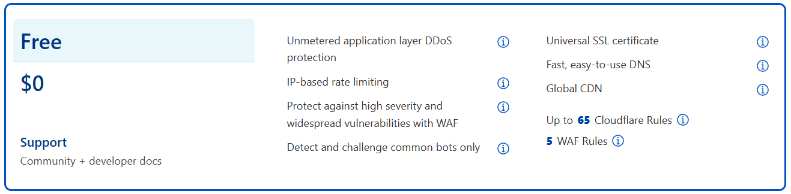
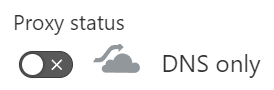

## Sections

1. [What and Why](#what)
2. [Pre-Requisites](#pre)
3. [Create OCI account](#account)
4. [Create a compute instance](#instance)
5. [SSH into instance](#ssh)
6. [Set up Tailscale](#tailscale)
7. [Configure DNS on Cloudflare](#cloudflare)
8. [Set up reverse proxy](#proxy)
9. [Add ingress rules on OCI](#ingress)
10. [Configure Plex](#plex)
11. [References](#ref)

<div id="what" />

## What and Why

Plex is a self-hosted media server that lets you stream your owned (or downloaded, or otherwise acquired) media from other devices on the same network, through a web-based GUI (access via browser) or dedicated app. (Say, on a smart TV or Roku device.) Plex has a built-in feature to share your media library externally, but that requires opening a port on your router and forwarding it to the Plex server. Setting aside that port forwarding can be dangerous if you don't know what you're doing, it won't work anyway if your home network is behind Carrier-Grade Network Address Translation, or CGNAT. Many ISPs use this, and so many homelabbers may find themselves unable to expose their services.

Although there are <a href="/blog/expose-plex-with-cloudflare#alt" target="_blank">other solutions</a> to get across CGNAT, this one can be set up with fairly minimal effort and does not run afoul of any service provider's rules.

What we'll be setting up is this:

- We will install Tailscale on the same server as Plex or, alternately, on another machine in the home network that will act as subnet router. (See <a href="https://tailscale.com/kb/1019/subnets" target="_blank">this section Tailscale docs</a> -- for this guide, we'll install Tailscale on the same server running Plex, so subnet routing isn't necessary.)

- We will create a free tier compute instance on Oracle Cloud Insfrastructure and install Tailscale on it, so it's on the same tailnet as the Plex server. We'll expose ports 80 and 443 to the internet on the VM, but only allowing access from specific IPs, and run a reverse proxy to forward web traffic to Plex.

<div id="pre" />

## Pre-Requisites

First of all, you should be comfortable using the terminal, because we'll be doing quite a bit through command line. (Ubuntu specifically, although you can use your preferred distribution.)

The method I explain here requires you to own a domain -- it may be possible to instead use something like DuckDNS or NoIP, but I have not tried it. I'll also be using Cloudflare for DNS, but that's just my personal preference -- feel free to use another DNS provider.

Finally, you'll need a Plex server already set up. (And I'll assume it's running in Linux or as a Docker container.) I won't go into how to do that here, <a href="/blog/setting-up-plex-in-docker" target="_blank">see this post</a> for instructions on running Plex as a Docker container.

<div id="account" />

## Create OCI account

We'll be using a free-tier VM from Oracle Cloud Infrastructure (OCI) -- specifically, an E2.1.Micro VM which runs on a single-core AMD OCPU, has 1 GB of memory and a 0.48 Gbps connection, more than enough for streaming even 4K content through Plex. You can run *TWO* of these free VMs **totally free**.

First, go to <a href="https://www.oracle.com/cloud/free/">Oracle Cloud's website</a> and click **Start for free** to create your account. You will need a credit card, but only for verification purposes! As long as you stick to *free tier* and don't upgrade, you won't be charged.

Once your account is set up you'll receive an email with the **Cloud Account Name** (which is your "tenant") and **Username**. (The email you used to sign up.) You'll need the Count Account Name to <a href="https://www.oracle.com/cloud/sign-in.html" target="_blank">sign-in to OCI</a>, after which you'll be asked for the email address and password.

> 
>
> You'll be asked if you want to **Enable Secure Verification (MFA)** which I strongly suggest you do. You'll need a USB security key or to download and use the Oracle Authenticator app. It's annoying to have to use another Authenticator app, but it's worth the peace of mind.

<div id="instance" />

## Create a compute instance

Once you're signed in to OCI, you'll be at the Get Started page. Click on **Instances** under the Service Links.

On the next page, look for **Compartment** on the sidebar, and choose your Cloud Account Name from the dropdown menu.

Click the **Create instance** button and do the following:

1. Name your instance to whatever you want. (Or leave the default generated name if you prefer.)

2. Scroll down to _Image and shape_, and click **Edit**.

3. The default _Shape_ (VM.Standard.A1.Flex) is nearly impossible to get, it's always "out of capacity." That's fine, it's overkill for this anyway. Click on **Change shape**.

4. Make sure _Instance type_ is **Virtual machines**.

5. Under _Shape series_, choose **Specialty and previous generation** which falls under the always-free tier.

6. Under _Shape name_, check the box for (the only option) **VM.Standard.E2.1.Micro**. (Notice the "always-free eligible** tag.) Click the **Select shape** button at the bottom.

7. The default image is Oracle Linux 8, but you can click **Change image** and choose one of the other always-free eligible images -- **Ubuntu** (my suggestion) or **CentOS**.

> 
>
> The rest of this guide assumes you chose **Canonical Ubuntu 22.04 Minimal** as your image.

8. Scroll down to _Add SSH keys_. You can upload your own public key, or you can let it generate a key pair for you. If you choose the latter, **make sure you save the private and private key** so you can SSH into the VM!

9. You can leave the rest as default, or change stuff around if you like. I'll let you make those choices yourself. When ready, click the **Create** button at the bottom.

Once the instance is fully provisioned and shows **Running**, you're good to go. Click on it and look for **Public IPv4 address**, take note of this!

<div id="ssh" />

## SSH into instance

We'll assume you generated a key pair and downloaded the private key to your Downloads folder. Use the following command:

```bash
ssh -i ~/Downloads/ssh-ssh-key-2024-01-30.key ubuntu@<Instance-IP>
```

For the future, you should create or edit the `~/.ssh/config` file, and add in something like the following:

```bash
Host oracle
    HostName <Instance-IP>
    IdentityFile ~/Downloads/ssh-key-2024-01-30.key
    User ubuntu
```

Once you're in, let's make sure everything is up-to-date.

```bash
sudo apt update && sudo apt upgrade -y
```

We're done in the Oracle instance for now, but we'll be back soon.

<div id="tailscale" />

## Set up Tailscale

Go to the <a href="https://tailscale.com" target="_blank">Tailscale website</a> and create an account. This will create your <a href="https://tailscale.com/kb/1136/tailnet" target="_blank">Tailnet</a> (private mesh network for all your Tailscale-connected devices) with your newly created account as the Owner and which you'll manage through the web-based <a href="https://login.tailscale.com/admin" target="_blank">admin console</a>.

Once you've got the account ready, use the following command in **both** the server where you're running Plex and the Oracle instance:

```bash
curl -fsSL https://tailscale.com/install.sh | sh
```

Once it's finished installing, use the command `sudo tailscale up` on both your server and the Oracle instance, go to the provided URLs and login to add both machines to your tailnet. Now go to the Tailscale admin console and you should see them both there.

Note that each machine running has a hostname and unique Tailscale IP. We'll need these later.

<div id="dns" />

## Configure DNS in Tailscale

On the _admin console_ go to the **DNS** tab.

First, notice the _Tailnet name_ is something auto-generated like `tailfe8c.ts.net`. Instead we'll use a "fun name" that is more human-readable and easier to remember. You can't just type one in, you choose from ones generated by Tailscale.

Click the **Rename tailnet...** button and follow the prompts. You can keep reloading until you find a fun name you like. For future examples, we'll assume your tailnet name is `cyber-sloth`.

Scroll down to the end of the page and click the **Enable HTTPS** button. Now we can provision TLS certificates for machines in your tailnet, so that you can reach them at `https://<name>.cyber-sloth.ts.net`.

In the terminals for each machine -- the Plex server and the Oracle instance -- use this command to generate the certificates:

```bash
sudo tailscale cert <name>.cyber-sloth.ts.net
```

From here on out we'll assume the Plex sever is `plex.cyber-sloth.ts.net` and the Oracle instance is `oracle.cyber-sloth.ts.net`.

<div id="cloudflare" />

## Configure DNS on Cloudflare

Now we'll go to Cloudflare to set up the external DNS, so they internet can go to `your-domain.com` and end up at the Oracle instance. Create a free Cloudflare account if you haven't ready.

We'll assume you need to add your domain to Cloudflare, but if you already did that [you can skip ahead](#skip).

From the Cloudflare dashboard, do the following:

1. On the sidebar, go to **Websites** and click the **Add a site** button.


2. Enter your domain and click **Add site**, then click on the **Free plan** at the bottom and click **Continue**.



3. After waiting a few moments for the DNS quick scan, you should see your domain’s DNS records appear. Click on **Continue**.

4. Cloudflare will now present you with the URLs to two _nameservers_, should be something like `adam.ns.cloudflare.com`. Leave this page open, we'll come back to it.

5. Login to the registrar that owns your domain, go into your domain's **DNS settings**, and change the _nameservers_ to both of the URLs provided by Cloudflare. (This is different for each domain registrar, you'll need to figure out how to do that on your own.)

6. Back in Cloudflare, click **Done, check nameservers**. It could take up to 24 hours for the change to propagate, but usually it will take less than an hour, and often less than 20 minutes. In the meantime, follow the _Quick Start Guide_.

7. Leave **Automatic HTTPS Rewrites** checked as-is, and enable the checkbox for **Always Use HTTPS**.

8. Leave **Brotli** on. On the summary, click **Finished**.

9. You'll be back at your site's Overview. If you still see _Complete your nameserver setup_, you can try using the **Check nameservers** button. In my experience that makes the DNS changes propagate within a few minutes.

Once your DNS changes have taken effect, the Overview page will say: _"Great news! Cloudflare is now protecting your site!"_

<div id="skip" />

With the domain set up in Cloudflare, we just need to add a DNS record:

1. On the sidebar go to **Websites**, choose your domain, then go to **DNS** -> **Records**.

2. Click on **Add record**.

3. For _Type_ choose **A** from the dropdown menu.

4. For _Name_ type in `your-domain.com`.

5. For _IPv4 address_ type in **the Oracle instance public IP**.

6. Under _Proxy status_ toggle it off to **DNS only**.



> 
>
> Make sure **NOT** to leave it proxied. If you do, all traffic will go though Cloudflare's CDN which we do not want. We're only using Cloudflare for DNS, nothing else!

7. Leave _TTL_ at Auto and click **Save**.

Next, we need to create an API token to edit the DNS config from third-party apps, we is necessary to get a HTTPS certificate in the reverse proxy later.

1. On the Cloudflare dashboard, click on **Websites** and choose your domain.

2. Under the _DNS column on the right side of the page_, scroll down to _API_ and click on **Get your API token**.

3. Click the **Create Token** button.

4. Choose the **Edit zone DNS template**.

5. Under Zone Resources, it should already be set to _Include_ and _Specific zone_ -- choose your domain from the dropdown menu and click **Continue to summary**.

6. On the next page, click **Create Token**.

7. *Important!* Copy your API token and **save it somewhere**, you won't be shown it again.

<div id="proxy" />

## Set up reverse proxy

Back in the Oracle compute instance, we'll be setting up Docker to run **Nginx Proxy Manager**. If you know what you're doing, feel free to use whatever reverse proxy you like, and run it however you like.

SSH into the instance and install Docker with the following command:

```bash
curl -fsSL https://get.docker.com | sh
```

We'll use Docker Compose to run the reverse proxy container.

1. Create the data directory for the reverse proxy and change into it with `mkdir ~/nginxproxy && cd ~/nginxproxy` (This assumes you're using the default `ubuntu` user.)

2. Create the compose file with `touch compose.yml` and edit it with `nano compose.yml`, copy & paste these contents into it:

```yaml
services:
  nginxproxy:
    image: docker.io/jc21/nginx-proxy-manager:latest
    container_name: nginxproxy
    volumes:
      - /home/ubuntu/nginxproxy:/data
      - /home/ubuntu/nginxproxy/letsencrypt:/etc/letsencrypt
    ports:
      - 80:80
      - 81:81
      - 443:443
    restart: always
```

3. Once the compose file is ready, run it with `docker compose up -d`

Once it's up and running, we need to access the Nginx Proxy Manager GUI. _I strongly suggest NOT opening port 81 on your instance._ (I'll talk about opening ports 80 and 443 in the next section.)

Instead, it's safer to install Tailscale on your PC or tablet, connect to the Tailnet, then on a browser go to `https://oracle.cyber-sloth.ts.net:81`. When you're done just disconnect the Tailscale client, and only connect when you need to access the GUI. (You may want to disable the Tailscale client from starting up at boot.)

Once in the Nginx Proxy Manager GUI, login with the default `admin@example.com` and `changeme` as the password. You'll want to change that before anything else.

Click on **Users** on the top nav bar, then to the right of the Administrator entry click the **three dots**. Choose **Edit Details** to change the email and **Change password** to change password. Log out and back in with the new credentials.

1. On the Dashboard, click **Proxy hosts** and then **Add proxy host**.

2. Type in `your-domain.com` under Domain Name.

3. Leave the Scheme as **http**.

4. Type in `plex.cyber-sloth.ts.net` under **Forward Hostname/IP**.

5. Type in `80` under **Forward Port**.

6. Toggle on **Websockets Support**, but leave the other two off.

7. Go to **SSL** tab and choose **Request a new SSL Certificate** from the dropdown menu.

8. Enable the toggle for **Use a DNS Challenge**.

9. Choose **Cloudflare** as DNS Provider from the dropdown menu.

10. In the credentials file content, delete the numbers after `dns_cloudflare_api_token=` and add in your **API token** instead.

11. Enable the toggle to agree to the Let's Encrypt TOS and click **Save**.

Give it a minute or two for Let's Encrypt to provision the TLS certificate, and the proxy host will then be created.

<div id="ingress" />

## Add ingress rules on OCI

Now to actually allow internet connections to the Oracle instance, we need to add ingress rules in the OCI dashboard. You really have two options here:

- Allow access from the entire internet and rely on authentication to block anyone that shouldn't have access.

- Allow access only from specific IPs, including yours, and block everyone else. (If they go to your domain they will get a 403 error.) **I strongly suggest this.**

Under _Instances_, click on your instance, and under _Instance details_ click on the link for Virtual Cloud Network, it should be something like `vcn-20777213-2003`.

In _Subnets_ click on the only choice, something like `subnet-20777213-2003`. Finally, click on the **Default Security List**.

1. Click **Add Ingress Rules**

2. Leave the source type as CIDR.

3. Under _Source CIDR_ type an IP you want to allow in this format `123.45.678.90/32`.

4. Leave the IP Protocol as TCP.

5. Leave the Source Port Range as Optional.

6. Set the _Destination Port Range_ as `80`.

7. Click on **+ Another Ingress Rule**, do the same but use `443` as _Destination Port Range_.

Repeat the above steps for **each** IP address you want to allow access. You want to have ingress rules that allow each IP to access both ports `80` and `443`.

Now if every step up till now has been done correctly, you should reach Plex when you go to `https://your-domain.com`. (You added ingress rules for your own IP, right?)

<div id="plex" />

## Configure Plex

One last thing! Although the allowed IPs can now reach Plex and stream your library by logging in to the Plex web UI at `https://your-domain.com`, using Plex apps will not work until you do the following:

1. On the Plex web UI, go to **Settings** by clicking on the _wrench icon_ at the top-left.

2. On the sidebar, scroll down to **Settings** and click **Network**.

3. Next to _Secure connections_, choose **Preferred** from the downdown menu.

4. (Optional) Scroll down and **enable** the checkbox for _Treat WAN IP as LAN Bandwitdh_.

5. Make sure to **leave disabled** the checkbox for _Enable Relay_.

6. Under _Custom server access URLs_ type in `https://your-domain.com`. (Make sure to include the HTTPS!)

7. At the bottom of the page, click the **Save changes** button.

Now your external users can access your library through their Plex apps too.

<div id="ref" />

## References

- <a href="https://www.cloudflare.com/service-specific-terms-overview/" target="_blank">Cloudflare Service-Specific Terms</a>
- <a href="https://developers.cloudflare.com/fundamentals/get-started/setup/add-site/" target="_blank">Cloudflare Docs - Add a site</a>
- <a href="https://developers.cloudflare.com/cloudflare-one/connections/connect-networks/install-and-setup/tunnel-guide/remote/" target="_blank">Cloudflare Docs - Tunnels</a>
- <a href="https://developers.cloudflare.com/cloudflare-one/connections/connect-networks/routing-to-tunnel/dns/" target="_blank">Cloudflare Docs - Routing traffic to a tunnel</a>
- <a href="https://developers.cloudflare.com/cloudflare-one/identity/idp-integration/google/" target="_blank">Cloudflare Docs - Identity</a>
- <a href="https://developers.cloudflare.com/cloudflare-one/policies/access/policy-management/" target="_blank">Cloudflare Docs - Policy Management</a>
