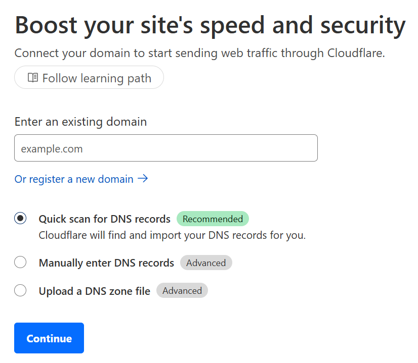
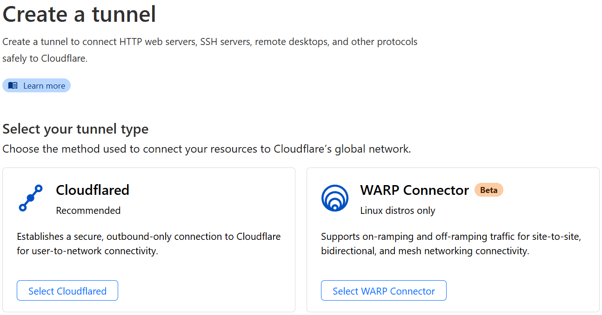

## Sections

1. [What and Why](#what)
2. [Pre-Requisites](#pre)
3. [Add a domain to Cloudflare](#domain)
4. [Create the Cloudflare Tunnel](#tunnel)
5. [Configure Cloudflare](#cloudflare)
6. [Configure Plex](#plex)
7. [Potential alternatives](#alt)
8. [References](#ref)

<div id="what" />

## What and Why

Plex is a self-hosted media server that lets you stream your owned (or downloaded, or otherwise acquired) media from other devices on the same network, through a web-based GUI (access via browser) or dedicated app. (Say, on a smart TV or Roku device.) Plex has a built-in feature to share your media library externally, but that requires opening a port on your router and forwarding it to the Plex server. Setting aside that port forwarding can be dangerous if you don't know what you're doing, it won't work anyway if your home network is behind Carrier-Grade Network Address Translation, or CGNAT. Many ISPs use this, and so many homelabbers may find themselves unable to expose their services.

Although there are many solutions to get across CGNAT, for Plex I've found that using Cloudflare Tunnel is the one with the least hassle. Cloudflare Tunnel provides a secure connection to a network resource behind CGNAT and without exposing your public IP, by running a `cloudflared` daemon on your server. As a by-product, the traffic flows through Cloudflare's CDN and gets all the features that come with that, including security through their Web Application Firewall. In this post I will demonstrate how I have been sharing my Plex library through a Cloudflare Tunnel and only allowing access from specific IP addresses.

> 
>
> **Important Note**
>
> Technically speaking, Cloudflare Tunnel is **NOT** intended for routing video and audio streams, it's intended purpose is routing HTTP traffic mainly for webpages. In fact, the <a href="https://www.cloudflare.com/service-specific-terms-application-services/#content-delivery-network-terms" target="_blank">Cloudflare Service-Specific Terms for their CDN</a> specifically state,
>
> *"Unless you are an Enterprise customer, Cloudflare offers specific Paid Services (e.g., the Developer Platform, Images, and Stream) that you must use in order to serve video and other large files via the CDN. Cloudflare reserves the right to disable or limit your access to or use of the CDN, or to limit your End Users’ access to certain of your resources through the CDN, if you use or are suspected of using the CDN without such Paid Services to serve video or a disproportionate percentage of pictures, audio files, or other large files."*
>
> Be aware that by using Cloudflare Tunnel, you are routing traffic through Cloudflare's CDN (can't have one without the other) and so using it with Plex may cause Cloudflare to limit or potentially even outright ban your account. By following this guide, *you agree to take the risk* that such action may occur, so *think carefully about this warning and whether it's worth it*.
>
> If you already have and use a Cloudflare account, I highly recommend creating a **separate Cloudflare account with another email address**, and only use this other account for hosting a Cloudflare Tunnel with Plex, so that any actions taken by Cloudflare against you are limited to this one account. Consider it a burner account that may not provide a permanent solution. (I suggest more permanent solutions at the end of the post.)
>
> I have successfully used this method to share my Plex library with only one other user, but their usage is mostly limited to one or two movies every weekend, which has resulted in around 50 to 80 GB of bandwidth per month, for the last 4 months. It's impossible to know if or when Cloudflare will decide enough is enough, but it's safe to assume multiple users consuming hundreds of GB of bandwidth per month will get on their radar faster than single-user low bandwidth usage. **Your mileage will vary.**

<div id="pre" />

## Pre-Requisites

This guide will assume you are already running Plex, and you're just looking to add a Cloudflare Tunnel so that you can share your library with other users. To that end, you will need a <a href="https://cloudflare.com" target="_blank">Cloudflare account</a>.

You will either be running the Cloudflare Tunnel on the same server as Plex (preferable) or on another machine on the same network that has access to the Plex server. This guide assumes that all hardware is running _Linux_, since that is the only OS I've used to run either Plex or `cloudflared`. Other options are available, and you should be able to tweak these instructions to work on other platforms.

In addition, the usage of Cloudflare Tunnel requires owning a domain. (Using a Dynamic DNS like DuckDNS or No-IP will not work.) If you need to purchase one, I suggest <a href="https://namecheap.com" target="_blank">Namecheap</a>, <a href="https://porkbun.com" target="_blank">Porkbun</a> or Cloudflare themselves.

Finally, I'll be using _Docker_ in order to run the `cloudflared` daemon as a container. You can run the daemon bare metal, but I prefer doing it as a container for that additional layer of abstraction, and so I can easily shutdown and restart the Cloudflare Tunnel as needed.

So if you have not already, install docker with the following command: (This will execute a bash script to install Docker with all dependencies and add-ons.)

```bash
curl -fsSL https://get.docker.com | sh
```

<div id="domain" />

## Add a domain to Cloudflare

If you registered a domain with Cloudflare, you can skip this part, but if you bought a domain from another registrar (Namecheap, Porkbun, etc.) you'll need to add it to Cloudflare.

1. Login to Cloudflare, go to **Websites** on the sidebar, and click the **Add a site** button.



2. Enter your domain and click **Add site**, then click on the **Free plan** at the bottom and click **Continue**.


3. After waiting a few moments for the DNS quick scan, you should see your domain’s DNS records appear. Click on **Continue**.

4. Cloudflare will now present you with the URLs to two _nameservers_, should be something like `adam.ns.cloudflare.com`. Leave this page open, we'll come back to it.

5. Login to the registrar that owns your domain, go into your domain's **DNS settings**, and change the _nameservers_ to both of the URLs provided by Cloudflare.

I tend to use Namecheap, so I can tell you if your domain is with them, go to _Domain List_ and click **Manage** next to the domain you want to add. Next to _Nameservers_ choose **Custom DNS** from the dropdown list, add the two Cloudflare nameservers, and click the green checkmark to finish.

6. Back in Cloudflare, click **Done, check nameservers**. It could take up to 24 hours for the change to propagate, but usually it will take less than an hour, and often less than 20 minutes. In the meantime, follow the _Quick Start Guide_.

7. Leave **Automatic HTTPS Rewrites** checked as-is, and enable the checkbox for **Always Use HTTPS**.

8. Leave **Brotli** on. On the summary, click **Finished**.

9. You'll be back at your site's Overview. If you still see _Complete your nameserver setup_, you can try using the **Check nameservers** button. In my experience that makes the DNS changes propagate within a few minutes.

Once your DNS changes have taken effect, the Overview page will say: _"Great news! Cloudflare is now protecting your site!"_ That means you're good to go.

<div id="tunnel" />

## Create the Cloudflare Tunnel

On the Cloudflare dashboard, click on _Access_ on the sidebar, then click on _Launch Zero Trust_ to open it in a new tab. Once at the Cloudflare Zero Trust dashboard, do the following:

1. On the sidebar, go to **Network** -> **Tunnels**.

2. Click the **Create a tunnel** button, choose _Cloudflared_ as the connector and click **Next**, give it a name, and click **Save tunnel**.


3. The next page will provide a docker command to install and run the `cloudflared` container.



> 
>
> If you are running your Plex container in a stack via **Docker Compose**, and want to just add `cloudflared` to it, <a href="https://gist.github.com/fullmetalbrackets/f747d43682c2f56a287ea42b309792ef" target="_blank">see this gist I made</a> and add the necessary bits to your `docker-compose.yaml`.


4. Once the container is up and running, check the Cloudflare configure tunnel page, your connector status be **Connected**.


5. Once the tunnel shows as Healthy, click the **Next** button. Now you'll be in the _Route Traffic_ page.


4. Under _Public hostnames_ type in your sub-domain (e.g. `plex`) and then your domain. Below that under _Services_, for _Type_ choose **HTTP** (_not HTTPS_), and for _URL_ enter the local IP address and port of the service you're exposing, e.g. `192.168.0.150:32400`. To finish, click the **Save tunnel** button.

5. Now, to verify everything is working as intended, go to _DNS_ -> _Records_ on the sidebar. You should see a `CNAME` record pointing the `plex` sub-domain to a URL like `5e126941-1234-8e13-4d80-02fe21084a62.cfargotunnel.com`. (The alpha-numeric string is your tunnel ID.)


Now you should be able to go to `https://plex.your-domain.com` and you should reach the Plex UI and be prompted to login! However, right now Plex is fully exposed to the entire internet. We need to use Cloudflare's WAF to restrict access to only who we want!

<div id="plex" />

## Configure Cloudflare

First, we're going to enable some security features to block bots.

1. On the Cloudflare dashboard, go to **Security** -> **Bots** on the sidebar, and enable **Bot fight mode**.


2. Next, go to **Security** -> **WAF** on the sidebar.

3. Click the _Custom rules_ tab and then the **Create rule** button.

4. Name the **Rule** as `Block bots`, then scroll down to _When incoming requests match..._.

5. For **Field** choose `Known Bots`.

6. Under _Then take action..._ choose `Block` as the action.

7. Click on **Deploy** to finish.


For this next part, you will need the specific IP addresses of your external users, because we're going to make Cloudflare block _everyone_ except for those IP addresses. In most cases, even when ISPs don't offer a static IP, a specific customer's IP address rarely changes, so you should be safe doing this. On the rare occassion where a user's public IP address changes, you can just come in here and update it. Sometimes prioritizing security means dealing with inconvenience.

Now, we're going to create a rule that blocks EVERYONE except specific IPs.

1. On the Cloudflare dashboard, go to **Websites** and choose your domain.

2. On the sidebar, go to **Security** -> **WAF**.

3. Click the _Custom rules_ tab and then the **Create rule** button.

4. Name the **Rule** as `Restrict IPs`, then scroll down to _When incoming requests match..._.

5. For **Field** choose `IP Source Address`.

6. For **Operator** choose `does not equal`.

7. For **Value** type in the public IP address.

8. Repeat these steps for each IP address you want to allow access.

9. Under _Then take action..._ choose `Block` as the action.

10. Click on **Deploy** to finish.


Next, I like to create an additional rule that lets external users' IPs _skip_ the WAF altogether. This ensures those IPs can get in, and has the side-effect of making connections from these IPs show up as events in WAF, which is nice for monitoring. (They will show as _Skipped_ in the Events activity log.)

1. On the Cloudflare dashboard, go to **Websites** and choose your domain.

2. On the sidebar, go to **Security** -> **WAF**.

3. Click the _Custom rules_ tab and then the **Create rule** button.

4. Name the **Rule** as `Allow IPs to skip WAF`, then scroll down to _When incoming requests match..._.

5. For **Field** choose `IP Source Address`.

6. For **Operator** choose `equals`.

7. For **Value** type in the public IP address.

8. Repeat these steps for each IP address you want to allow access.

9. Under _Then take action..._ choose `Skip` as the action and enable the checkmarks for all WAF components.

10. Click on **Deploy** to finish.


Now let's set the order of these rules in WAF.

1. On the Cloudflare dashboard, go to **Security** -> **WAF** on the sidebar.

2. Click the _Custom rules_ tab and then the **Create rule** button.

3. Drag and drop the rules so that _Allow IPs to skip WAF_ is first, _Restrict IPs_ is second and _Block bots_ is third.

Finally, let's disable caching to minimize CDN usage by our external users and ensure all content always comes directly from the origin.

1. On the Cloudflare dashboard, go to **Websites** and choose your domain.

2. On the sidebar, go to _Caching_ and click _Cache rules_.

3. Click on **Create Rule**.

4. Name the **Rule** as `Disable caching`, then scroll down to _When incoming requests match..._.

5. For **Field** choose `Hostname` for field

6. For **Operator** choose `Equals`

7. For **Value** use your domain, e.g. `plex.your-domain.com`. (Leave out the HTTPS.)

6. Under _Cache eligibility_ choose _Bypass cache_.

7. Click on **Deploy** to finish.


<div id="plex" />

## Configure Plex

One last thing! Although your external users can now stream your library by logging in to the the Plex web UI at `https://plex.your-domain.com`, using Plex apps will not work until you do the following:

1. On the Plex web UI, go to **Settings** by clicking on the _wrench icon_ at the top-left.

2. On the sidebar, scroll down to **Settings** and click **Network**.

3. Next to _Secure connections_, choose **Preferred** from the downdown menu.

4. (Optional) Scroll down and **enable** the checkbox for _Treat WAN IP as LAN Bandwitdh_.

5. Make sure to **leave disabled** the checkbox for _Enable Relay_.

6. Under _Custom server access URLs_ type in your tunnel URL, e.g. `https://plex.your-domain.com` (Make sure to include the HTTPS!)

7. At the bottom of the page, click the **Save changes** button.

Now your external users can access your library through their Plex apps too.

<div id="alt" />

## Potential alternatives

There's always multiple ways to do things, and said I explained at the start, this method of sharing your Plex library may not be best. It's just what works for me, for now, so I figured I'd share it for others to try out. Some other alternatives that I've read about, but have not tried myself:

- <a href="https://tailscale.com" target="_blank">Tailscale</a>: Tailscale is a Wireguard-based overlay network for connecting devices across different networks. <a href="/blog/tailscale" target="_blank">I already use Tailscale to access Plex from my phone and tablet when not home</a>, but I have not set it up for other users. It requires a machine running Tailscale by each external user, then inviting them to your tailnet and using ACLs to limit access only to Plex. There's also the beta feature <a href="https://tailscale.com/kb/1223/funnel" target="_blank">Funnel</a>, which exposes a service similar to a Cloudflare Tunnel and does not require the user to run Tailscale, but <a href="https://www.reddit.com/r/Tailscale/comments/188jvlr/is_funnels_really_slow/" target="_blank">the speed may not be great</a> and funnel traffic <a href="https://tailscale.com/kb/1223/funnel#limitations" target="_blank">is subject to bandwidth limits</a>. (Though I can't find what those limits are anywhere.)

- <a href="https://www.zerotier.com" target="_blank">Zero Tier</a>: I have not used it myself, but Zero Tier is a similar product to Tailscale for similar use cases, namely securely connecting to your network from outside. I have read of people using it to access Plex remotely, but it requires each external user to run Zero Tier. (Just like Tailscale.)

- <a href="https://zrok.io" target="_blank">Zrok</a>: A newer kid on the block, free to self-host. I've read enough to know that you can use it for secure peer-to-peer connections and use tunnels for public sharing, but no idea how it would work with Plex. I did find <a href="https://blog.openziti.io/its-a-zitiful-life" target="_blank">this blog post from December 2022</a> about using a component of OpenZiti (the ) called <a href="https://github.com/openziti/ziti-browzer-bootstrapper" target="_blank">BrowZer</a> to remotely access Plex, but it seems they have not written anything further about this possible use case since then.

- Some others I've heard of, but have not touched or read about include <a href="https://ngrok.com" target="_blank">Ngrok</a>, <a href="https://netmaker.io" target="_blank">Netmaker</a> and <a href="https://netbird.io" target="_blank">Netbird</a>.

<div id="ref" />

## References

- <a href="https://www.cloudflare.com/service-specific-terms-overview/" target="_blank">Cloudflare Service-Specific Terms</a>
- <a href="https://developers.cloudflare.com/fundamentals/get-started/setup/add-site/" target="_blank">Cloudflare Docs - Add a site</a>
- <a href="https://developers.cloudflare.com/cloudflare-one/connections/connect-networks/install-and-setup/tunnel-guide/remote/" target="_blank">Cloudflare Docs - Tunnels</a>
- <a href="https://developers.cloudflare.com/cloudflare-one/connections/connect-networks/routing-to-tunnel/dns/" target="_blank">Cloudflare Docs - Routing traffic to a tunnel</a>
- <a href="https://developers.cloudflare.com/cloudflare-one/identity/idp-integration/google/" target="_blank">Cloudflare Docs - Identity</a>
- <a href="https://developers.cloudflare.com/cloudflare-one/policies/access/policy-management/" target="_blank">Cloudflare Docs - Policy Management</a>
