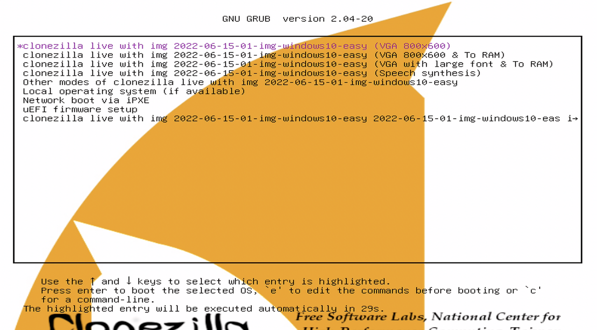
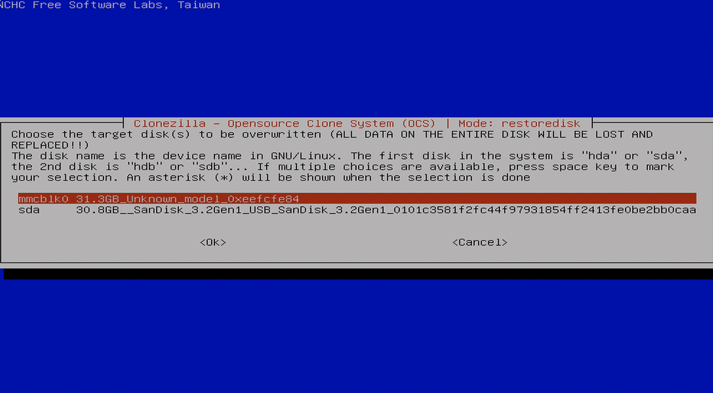
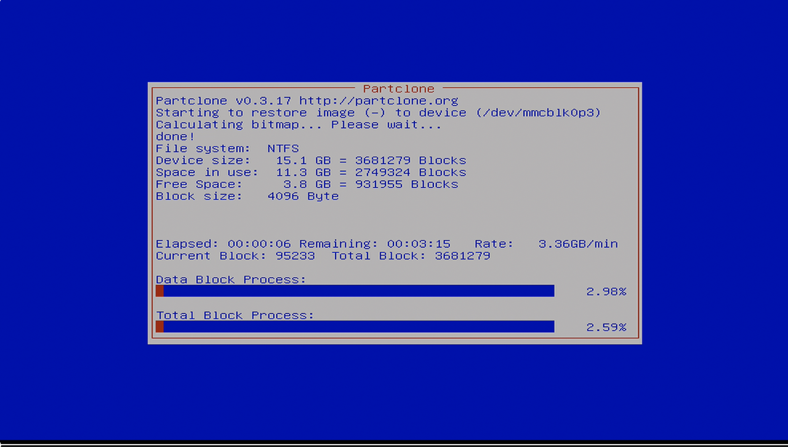
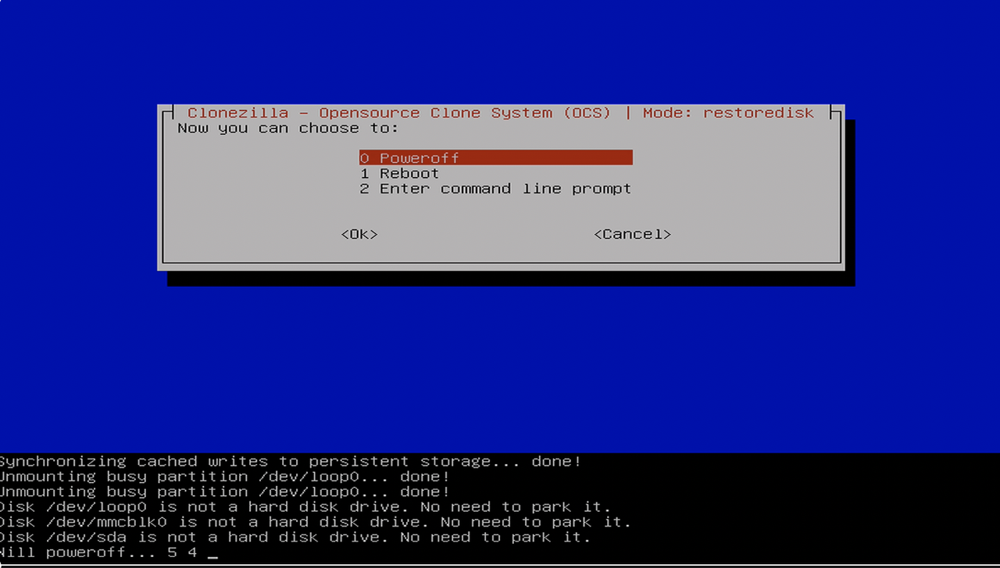

## Table of Contents

1. [About the ZimaBoard](#about)
2. [Pre-requisites](#pre)
3. [Downloading image and creating bootable USB](#image)
4. [Install the image on ZimaBoard](#install)
5. [References](#ref)

<div id='about'/>

## About the ZimaBoard

<a href="https://www.zimaspace.com/products/single-board-server" target="_blank">ZimaBoard</a> is a "hackable" x86 single board server, by default it comes running Debian and CasaOS, and is meant to be the hub of your personal self-hosted cloud. Through a simple web GUI you can install and manage different apps and services as Docker containers. The ZimaBoard 232 specifically has a Intel Celeron dual core N3350 CPU with integrated graphics and 2 GB of DDR4 RAM. The higher end 432 and 832 models have better Celeron CPUs and more RAM. All the models have a 32 GB eMMC and two SATA ports for more storage, two USB 3.0 ports, two gigabit ethernet ports and even a PCIe 2.0 x4 port. The 12V charger sips power at around 5 to 6 watts.

<div id='pre'/>

## Pre-requisites

Installing any image will require a USB drive (<a href="https://www.amazon.com/SamData-Swivel-Storage-Indicator-8GB-1Pack/dp/B08CRMBD93" target="_blank">here's an 8gb one for $5 on Amazon</a>) and a monitor to use the installation GUI. Since the ZimaBoard has no HDMI port, only a Mini-DisplayPort 2.0 port, a Mini DisplayPort to HDMI adapter cable is required. I used <a href="https://www.amazon.com/dp/B0757JWW81" target="_blank">this one from Amazon for $9</a>.

<div id='image'/>

## Downloading image and creating bootable USB

I'm generally following the <a href="https://www.zimaspace.com/docs/faq/Restore-factory-settings" target="_blank">official ZimaBoard CasaOS Factory Recovery instructions</a> with only a few changes. Basically, we must download the image that comes installed on Zimaboard and install it on the machine using a bootable USB drive.

In my case, I have the ZimaBoard 232, and used the <a href="https://drive.google.com/file/d/1PFw1JXoimwUvOX9kgkmOSUM0evi_GGxv/view" target="_blank">ZimaBoard 216 image</a>. There is a <a href="https://drive.google.com/file/d/1b-k7d1LzPHNUtem-hOrHB5dDt0_AC6mK/view" target="_blank">separate image for ZimaBoard 432 & 832</a> if you have one of those instead.

Although the instructions say to use BalenaEtcher, on Windows I always have and always will use the minimal and reliable <a href="https://rufus.ie" target="_blank">Rufus</a>. I prefer to use the portable version and encourage you to do the same.

Plug in a USB drive with 8gb or more capacity, double-click Rufus to open it (it will need to be run as Administrator), and the USB drive should appear under _Devices_, otherwise select it from the dropdown.

Under _boot selection_, click the **Select** button to the right, navigate to and select the image file, and click **Open**. Leave all options at default and click the **Start** button at the bottom.

You may get a warning about the image, ignore it. You should get prompted to write the image either in ISO or DD mode -- _I had to choose DD mode for the Zimaboard to recognize the image_.

Once the image is done writing to the USB drive, you can close Rufus.

```bash
dpkg -i mergerfs_2.40.2.debian-bookworm_amd64.deb
```

<div id='install'/>

## Install the image on ZimaBoard

Plug the USB drive into one of the ports on the ZimaBoard and then plug it into the power. (Plug a keyboard or dongle on the other USB port, you'll need it.) While the machine boots up, start mashing the **F11** button and you'll be presented with a menu to _please select boot device_, scroll down to the USB drive and press the Enter key.

After a moment you'll see the Clonezilla GUI -- choose the first option (VGA 800x600) and hit Enter.



Next you'll have to choose the disk to install onto, choose the first option `mmcblk0`, and hit Enter twice.



Next in the CLI, when prompted with warnings (your data will be lost, etc.) type `y` and hit Enter to confirm install. Wait a few minutes while the installation happens.



Once the install is finished, you'll see another menu. Choose the first option **Power off** and hit Enter.



Once the countdown is complete, the ZimaBoard will shutdown. Confirm that the red light on the machine is off, unplug the power and USB drive (and keyboard, you won't need it anymore), and plug in an ethernet cable if you haven't already. When ready, plug the power cord back in and give the ZimaBoard and CasaOS a few minutes to fully boot up essentially for the first time.

On a browser in the same local network, go to `http://casaos.local` and the CasaOS web UI should appear prompting creation of a new user.

<div id='ref'/>

## References

- <a href="https://www.zimaspace.com/docs" target="_blank">ZimaBoard documentation</a>
- <a href="https://www.zimaspace.com/docs/faq/Restore-factory-settings" target="_blank">ZimaBoard CasaOS Factory Recovery instructions</a>
- <a href="https://rufus.ie" target="_blank">Rufus</a>
