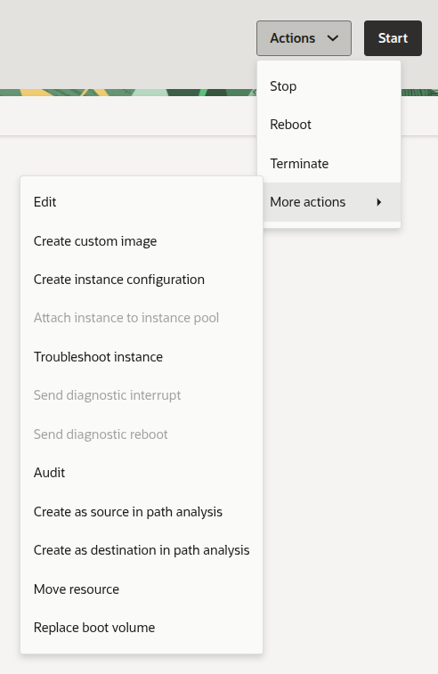
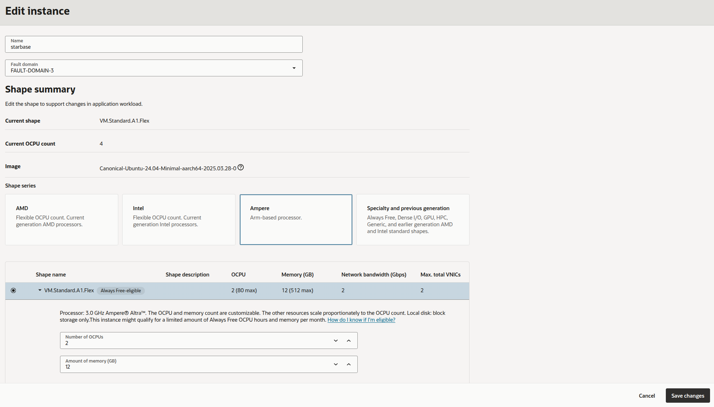

> These instructions are [straight from the OCI documentation](https://docs.oracle.com/en-us/iaas/Content/Compute/Tasks/resizinginstances.htm), and should only take a few minutes to do. For additional information on the new Ampere A1 free tier limits, [see this post on the OCI subreddit](https://www.reddit.com/r/oraclecloud/comments/1u4lzkk/new_free_tier_limits_confirmed_by_oracle_support/) and [this section of the OCI docs](https://docs.oracle.com/en-us/iaas/Content/FreeTier/freetier_topic-Always_Free_Resources.htm).

## Changing the shape of an existing instance

Login to your OCI account and [navigate to _Instances_ on the dashboard](https://cloud.oracle.com/compute/instances). Click on the specific instance you want to edit, and on the instance details page click on the **Actions** button on the top-right, on the dropdown choose **More actions**, then click on **Edit**.

> You can shutdown the instance while changing the shape if you'd like, but this is not necessary since changing the shape of a running instance will automatically force a reboot.

:::image-figure[Choosing to Edit from the Actions > More actions.]

:::

On this next page, scroll down to your `VM.Standard.A1.Flex` shape and **click on the little arrow to the left of the shape** -- this will open a dropdown that lets you change the _Number of OPCUs_ and _Amount of memory (GB)_.

Change the number of _OPCUs_ to **2** and change the _amount of memory_ to **12**. (Note that this will lower the network bandwidth, nothing you can do about this since each OCPU grants 1 Gbps of bandwidth.)

Click on the **Save changes** button to finish.

:::image-figure[Reducing the OCPUs and Memory on existing Ampere A1 instance.]

:::

## References

- [Reddit post about the change to Ampere A1 free-tier limits](https://www.reddit.com/r/oraclecloud/comments/1u4lzkk/new_free_tier_limits_confirmed_by_oracle_support/)
- [OCI Documentation - Always Free Resources](https://docs.oracle.com/en-us/iaas/Content/FreeTier/freetier_topic-Always_Free_Resources.htm)
- [OCI Documentation - Resizing Instances](https://docs.oracle.com/en-us/iaas/Content/Compute/Tasks/resizinginstances.htm)
