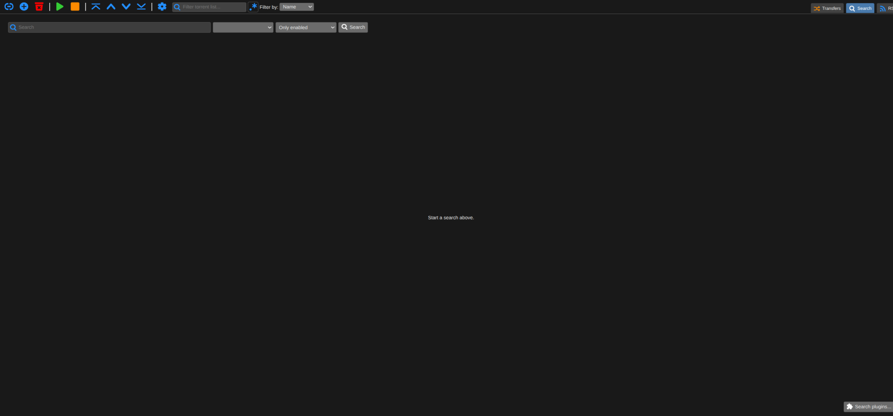

## Add default search engine plugins

> This worked for me running qBittorrent as a Docker container using the [Linuxserver image](https://hub.docker.com/r/linuxserver/qbittorrent). Safe to assume it also works if running qBitorrent bare metal, but I can't be absolutely sure.
> 
> Also, if you are running a custom web UI like VueTorrent, disable it temporarily and use the default qBittorrent web UI to do this.

First things first, you should add the default plugins that qBittorrent comes with (which are not enabled until you do it manually) to setup the search engine. After that you can add additional search engine plugins.

1. In the qBittorrent *default* web UI, click on the **Search** button at the top right. You should see the below page. (Note that I am using dark mode.)

2. Click on the button at the bottom-right that says **Search plugins...**.

3. In the window that opens, you'll see *Installed search plugins:* but it should be empty. Click the **Check for updates** button and all the default search plugins should get installed automatically.

> [warning] Important!
>
> One of the default plugins is for [Jackett](https://github.com/Jackett/Jackett) and its URL will be `http://127.0.0.1:9117`. If you are not running Jackett, *Right-Click* on it and choose *Uninstall*. If you don't do this, you'll get an error when searching because it can't reach Jackett.
>
> If you *are* running Jackett, but at a different URL than the default one provided by the plugin, just click on **Install new plugin** and enter the IP address with network port of your Jackett instance, e.g. `http://192.168.0.100:9117`, or if using a reverse proxy enter the URL like `https://jackett.yourdomain.com`.

## Add additional plugins

You may have noticed during the previous step that you can [get new search engine plugins](https://github.com/qbittorrent/search-plugins/wiki/Unofficial-search-plugins). Search plugins are all community-maintained, and some have not been updated in years or have even been archived. However, plenty of these are still handy to add depending on the types of torrents you tend to look for.

To use one of the plugins listed in the repo, look for the little download link next to the plugin's author, *Right-Click* and *Copy link address*.

Back in the qBittorrent Search plugins window, click on the **Install new plugin** button, paste the URL and click **Ok** to install the plugin.

## Using the search engine

With your search plugins now installed, there's a few things to note. To the right of the search form, there is a dropdown that says *All categories*, if you add plugins that are for different plugins (say one for anime and one for games) then you should pick a category from the dropdown to search only within it.

The next dropdown to the right that shows *Only enabled* lets you pick a specific plugin to search with, for even more granular searching.

When searching, note the tab for *Engine* which is the plugin being used to source the search result. You can click on any of the tabs to sort the results by that, for example by *Seeders* or by *Size*.

Happy sailing!