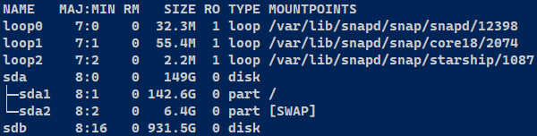
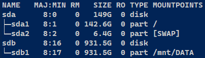
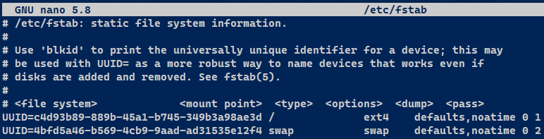
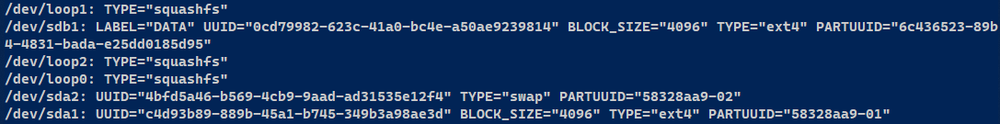
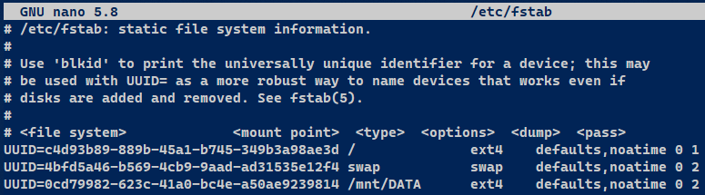

When using Linux headless, such as via SSH or with no desktop environment, accessing a newly So how do we access a newly added hard drive in Linux? In Windows and most Linux desktop environments, a newly connected internal or external hard drive will be automatically detected, mounted and show up in file explorer (or your desktop environment's equivalent), but how does it work over command line with no GUI?

For purposes of this explanation, let's assume you have a Linux server you just installed a new internal hard drive in. (The process is nearly identical for external drives.) This server has no desktop environment, so we're using only the command line. In Linux, all devices connected to the computer, including hard drives, are located in the root `/dev` directory. Each hard drive, whether internal or external, are given their own sub-directory within it. If your hard drives use SCSI (and they likely do if built in the last decade) then your boot drive will be `/sda`. On the off chance you're still using IDE hard drives, the master drive will be `/hda`, and the slave drive will be `/hdb`.

First, let's list out our hard drives on the terminal. There are several ways to do this, but the one I find most user friendly is `lsblk` -- using it will output a nicely formatted list of all devices, including hard drives and their partitions. Partitions within a hard drive are named, for example, `sda1`, `sda2`, etc. Let's see the output of `lsblk`:



The output shows this computer has a primary hard drive, `/sda`, with two partitions. `/sdb` is an additional 1TB hard drive installed. In my case this drive was previously partitioned, has data on it, but the data is inaccessible because it is not mounted. If you need to partition the hard drive, use the following command:

```bash
sudo fdisk /dev/sdb
```

This will change the terminal to a prompt, press `m` to bring up a list of commands. You'll see that you use `d` to delete partitions and `n` to create new ones. We'll create a new one here and give it the default number of `1`, then use `w` to save and quit. Now when you use the `lsblk` command you'll see the `_sdb1_` partition listed.

To access and interact with files, the partition needs a file system. Since this is on Linux, we'll just use <em>ext4</em>. Use the following command:

```bash
sudo mkfs -t ext4 /dev/sdb1
```

Now you mount that partition onto a specific directory. Common practice is to mount internal hard drives that will stay at work long-term to `/mnt` in the root directory. Or at least I heard that somewhere and adopted it as a common practice for myself. I'll create a sub-directory within like this: `mkdir /mnt/DATA`

Now we mount the `sdb1` partition to that new directory with this command:

```bash
mount /dev/sdb1 /mnt/DATA
```

Let's check out our list of devices again, but it's refine the output of lsblk by piping it into grep like so:

```bash
lsblk | grep -v 7:
```

The `-v` option will filter out any lines with the character `7:`. Without getting into the weeds of device numbers, in the prior output of lsblk it shows block devices have the major number 7 while hard drives have the major number 8, both separated from the minor number by a colon. So by piping `7:` through grep I can list only hard drives. Here's the output:



There it is! In my case I made a primary partition taking up the entire 1TB hard drive. Now I can see the contents by using `ls /mnt/DATA`. But there's one last thing to do. This drive will not stay mounted on reboot by default, so let's make sure we make it stay. This is done by editing the `fstab` file. Let's do that with `sudo nano /etc/fstab`.



It gives you the instructions right there, very plainly. Let's do as it says and use the command `blkid`. (If there's no output, do it with `sudo`.)



Since the drive is mounted, it's helpfully labeled, so you can figure out which one it is at a glance. Copy the `UUID`, then paste it into the fstab file and add the other options as instructed:



Simple. We're using `ext4` as the file system, which is how I partitioned it, but if it the file system is different use the correct one -- e.g `ntfs`, `zfs`, etc. We are using the same options as the swap partition for this hard drive, let's call these basic options.

> 
>
> The number at the end of each line is important, its the order filesystems are checked at boot time. Make sure your root drive is always set to `1`, non-root mount points should be set to `2`.

Save and close the fstab file. Now when you reboot, the second hard drive should always auto-mount to `/mnt/DATA`. This guide was for an internal hard drive specifically, but as I said before, everything is identical for external USB drives; they show up as `sdb`, `sdc`, and so on. The HDDs inside the external drives are SCSI, and so are USB sticks. Mount all the things!

## Related Articles

> [Linux Commands & Keyboard Shortcuts Cheat Sheet](/blog/basic-linux-commands/)

> [Formatting disks in Linux command line](/blog/formatting-on-linux/)


## References

- <a href="https://man7.org/linux/man-pages/man2/mount.2.html" target="_blank">Linux man page for MOUNT</a>
- <a href="https://man7.org/linux/man-pages/man5/fstab.5.html" target="_blank">Linux man page for FSTAB</a>
