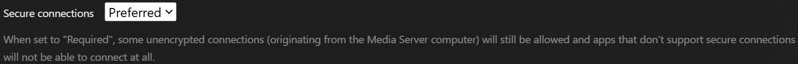

## About Plex and Remote Access

<a href="https://plex.tv/personal-media-server/" target="_blank" umami-data-event="plex-remote-access-to-plex-site">Plex Media Server</a> is a self-hosted media server that lets you stream your owned (ripped, downloaded, or otherwise acquired) media from other devices on the same network, through a web-based GUI (access via browser) or dedicated app. (Say, on a smart TV or Roku device.) Plex lets you stream videos and music through a slick Netflix-like user interface, and Plex also offers the excellent <a href="https://plex.tv/plexamp/" target="_blank" umami-data-event="plex-remote-access-to-plexamp">Plexamp</a> music player app for Android and iOS devices, so you can stream music on the go through a dedicated UI. All metadata including media details, episode/track lists, movie/album art, etc. is handled by Plex automatically.

Plex Media Server has a built-in feature called <a href="https://support.plex.tv/articles/200289506-remote-access/" target="_blank" umami-data-event="plex-remote-access-to-remote-access-docs">Remote Access</a> that can be configured from the web UI. By enabling Remote Access, and forwarding network port 32400 from your router (we'll get to that), you can access Plex from other devices using your account, like a phone or tablet. Setting up remote access also allows you to share your media library externally with other Plex users, so they can access your server and stream the shared content directly from you.

> [warning] Important!
>
> The remote access feature, and sharing your library with friends, requires _either_ a <a href="https://www.plex.tv/plans/" target="_blank" umami-data-event="plex-remote-access-to-plex-pass">Plex Pass subscription</a> for the person running Plex Media Server, _or_ any external users you've shared with will _each_ require a <a href="https://support.plex.tv/articles/remote-watch-pass-overview/" target="_blank" umami-data-event="plex-remote-access-to-watch-pass">Remote Watch Pass subscription</a>.

> Another caveat to note is that Plex remote access will _not_ work if your Plex Media Server is behind CGNAT. Many ISPs put their users behind _CGNAT_ unless they have a _static IP address_, but this often comes at an additional cost. Check with your ISP for details.
>
> If you want to remotely access Plex for yourself through CGNAT, I suggest using [Tailscale](https://tailscale.com) -- [see this blog post](/blog/plex-remote-access-tailscale/) for a guide on setting that up. To then share your library with friends, they would normally have to run Tailscale themselves too, but there is another way if you're willing to work for it -- [see this other post for details](/blog/expose-plex-tailscale-vps/).

## About GL.iNet Flint 2

[GL.iNet](https://www.gl-inet.com/) is a manufacturer of innovative networking hardware based on open-source software, including home and travel routers, IoT and security gateways, KVM devices, and more. The [GL-MT6000 Flint 2](https://www.gl-inet.com/products/gl-mt6000/) is one of their premiere products, built on top of [OpenWRT](https://openwrt.org/) and boasting many modern features.

Among other things, it lets you configure firewall rules, port forwarding, and universal plug and play. (We will not be using UPnP though -- you should never use it!)

## Pre-Requisites

This guide assumes you already have the Flint 2 (or whatever router you're using) up and running. I won't go into setting up the Flint 2 from scratch for a first time user. (Maybe I'll write a post about it if there is interest, or I ever get another GL.iNet product.)

Likewise, this guide assumes you already have a Plex Media Server already set up and running. I won't go into how to install Plex here, [see this blog post](/blog/setting-up-plex-in-docker/) for detailed instructions on running Plex as a Docker container in Linux.

## Port forwarding on Flint 2 router

Plex Media Server uses **network port 32400** for everything: to communicate with the Plex servers (for auth, metadata, etc.), to expose the web-based user interface, and for remote access. As a result, 32400 the only port we need to open to the internet, or WAN, and forward to the Plex Media Server on the internal network, or LAN.

> Although I'm providing instructions specifically for the GL.iNet Flint 2 (which I assume should work identically or at least similarly on other GL.iNet hardware), it should still help with other routers as long as they're capable of port forwarding; not all routers can do it, but those that can do it mostly do it the same.

On your browser, go to your Flint 2 router's web UI (most likely something like `http://192.168.0.1`) and login. On the sidebar to the left, click on **Network** to open a dropdown, then go to **Port Forwarding**.

:::image-figure[Going to port forwarding settings in GL.iNet Flint 2]

:::

On this page, ignore the DMZ section and under _Port Forwarding_ click on the **+ Add** button. You should fill out the information like so:

1. Leave the _Protocol_ as **TCP/UDP**, and leave _External Zone_ as **WAN**.

2. For the _External Port_ type in the Plex port, `32400`.

3. For the _Internal Zone_, leave it as **LAN**.

4. For the _Internal IP_ type in the Plex server's **internal IP address**, for example `192.168.0.125`.

5. For the _Internal Port_ type in the Plex port again, `32400`.

6. Add a _Description_ if you want, make the **Enable is toggled on**, and click **Apply**.

:::image-figure[Setting up a port forward in GL.iNet Flint 2]

:::

> If you prefer, you can forward a different external port, like `50000` or whatever, to Plex's internal port of 32400. It may be a little more secure not to use Plex's default port, but I myself don't bother.
>
> Plex seems to do a good job of securing it's remote access and I've never personally heard of anyone getting breached through Plex and port 32400. The choice is yours, though. If you go this route, you'll just have to make one extra change in Plex Media Server, which I'll get to later.

Now you should see the new port forward you added.

:::image-figure[Added port forward in GL.iNet Flint 2]

:::

We're done here. Now let's configure Plex.

## Configuring the Plex Media Server for remote access

Go to your Plex Media Server's web-based user interface (server settings can only be changed here, not through any of the apps), probably by going to the internal IP address of the Plex server on a browser, for example `http://192.168.0.125:32400/web`.

Click on the wrench icon at the top right of the window to get into the Plex server settings.

:::image-figure[Wrench icon leading to Plex Media Server settings.]

:::

Now on the sidebar to the left, scroll down to _Settings_ and go to **Network**.

:::image-figure[Wrench icon leading to Plex Media Server settings.]

:::

First things first, _secure connections_ is probably set to **Required**. This is the default setting and should work without issue, but some older clients not have trouble connecting. If any of your devices, or devices of friends you've shared with, are unable to connect in the future you can change this to **Preferred** and it should work. Modern clients should be able to connect securely, though.

:::image-figure[Secure connections setting in Plex Media Server.]

:::

Next, scroll down to where it says _Enable Relay_. If this setting is on, and a remote Plex client is unable to establish a direct connection, Plex's own servers will relay the connection to allow access. This should not be necessary if you set up Plex Remote Access properly, and Plex relays have an upper bandwidth limit of around 4 Mbps, so it's not an ideal experience anyway.

Personally, I always **uncheck the box to turn off relay** to force a direct connection, or else not allow access at all if direct is not possible.

:::image-figure[Disabling relay in Plex Media Server.]

:::

You can customize some other settings here to your liking, but since we are just port forwarding from the router, nothing else is required here. On the sidebar, go to _Remote Access_. On this page, click on the button to **Enable Remote Access**.

You should also enable _Manually specify public port_, type in the Plex port and click **Apply**. It may not be required for everyone, but remote access doesn't work for me without it.

:::image-figure[Manually specifying Plex public port.]

:::

> If you're setting things up differently and forwarding another outside port (rather than `32400`) to Plex's internal port, then type in that outside port here.
>
> In that case the above would be `[internal IP]:32400 <- [external IP]:50000 <- Internet` if you were forwarding _external port 50000_ on the router to Plex's internal port of 32400.

Give it a minute and you should see it say _Fully accessible outside your network_ in green.

:::image-figure[Plex Media Server with remote access enabled and working.]

:::

If you see this message remain and not turn red saying "Not available outside your network," then you're good to go. You should also see a green checkmark next to _Remote Access_ on the sidebar.

:::image-figure[Remote Access green checkmark in Plex Media Server settings.]

:::

> There is an alternate method of exposing Plex for remote access, where you use a custom domain and reverse proxy, ideally with TLS certificates, to forward external port 443 to Plex's internal port 32400.
>
> Some people believe this is more secure, but I don't agree -- 32400 is well-known to only be used for Plex, and Plex themselves are good about securing their servers and apps, whereas exposing port 443 paints a giant beacon on your IP address that every bot will scan incessantly forever.
>
> All that extra effort just to make yourself more noticeable to the internet does not sounds like a good idea to me, so I don't suggest it and won't explain how to do it here. There are many other guides available if you decide to go that route.

## References

- <a href="https://www.plex.tv/plans/" target="_blank" umami-data-event="plex-remote-access-to-plex-pass">Plex Pass</a>
- <a href="https://support.plex.tv/articles/remote-watch-pass-overview/" target="_blank" umami-data-event="plex-remote-access-to-watch-pass">Plex Remote Watch Pass</a>
- <a href="https://www.plex.tv/blog/important-2025-plex-updates/" target="_blank" umami-data-event="">Plex updates to Plex Pass and Remote Access</a>
