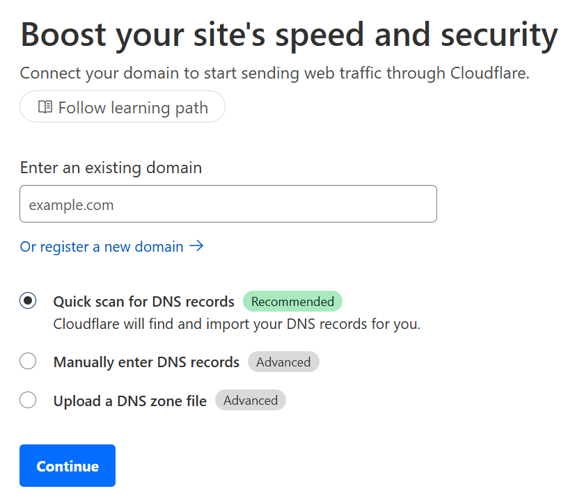
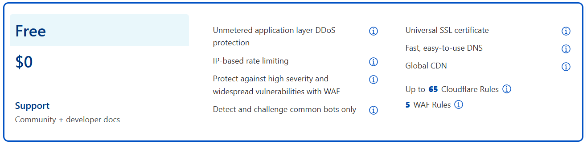
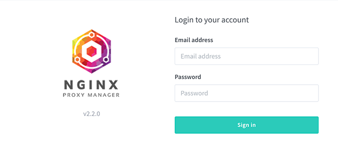
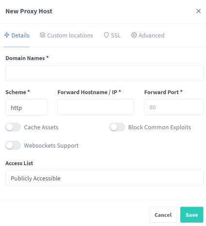
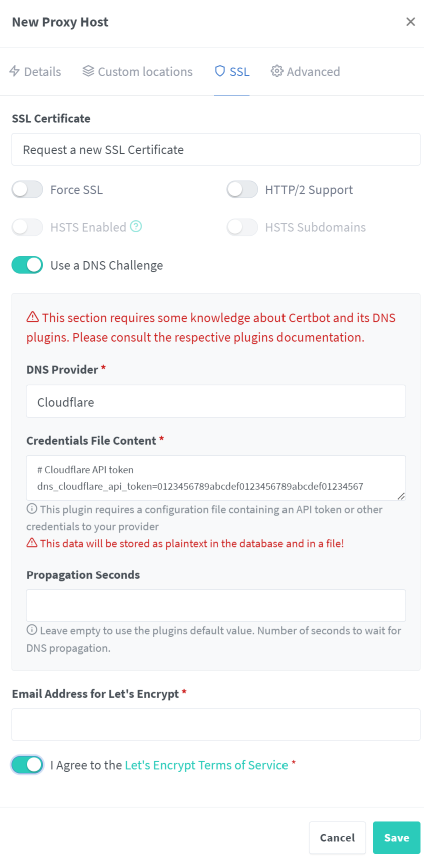

## Sections

1. [Pre-Requisites and Caveats](#pre)
2. [Setting up Pi-Hole as network DNS server](#pihole)
3. [Configuring the domain in Cloudflare](#domain)
4. [Install and configure Nginx Proxy Manager](#nginx)
5. [Accessing Pi-Hole web UI with HTTPS](#https)
6. [References](#ref)

<div id='pre' />

## Pre-Requisites and Caveats

First of all, this guide uses specific third-party services like Cloudflare and open-source apps like Pi-Hole and Nginx Proxy Manager to set up a secure local-only reverse proxy. The same is possible with other tools, apps and services including Adguard Home or Next DNS instead of Pi-Hole, Caddy or Traefik instead of Nginx, any other DNS provider instead of Cloudflare, etc. I'm only writing about my preferred tools that I've used multiple times to set everything up and keep it running for over a year.

This guide will require a owned custom top-level domain (TLD), such as a `.com` or `.cc` or `.xyz`, etc. Certain TLDs can be bought for super cheap on Namecheap or Porkbun, but be aware in most cases after the first year or two, the price will see a steep jump. I again prefer Cloudflare for purchasing domains, since they always price domains at cost, so you won't see any surprise price bumps one year to the next. An alternative I won't be getting into is using dynamic DNS, as I've not had to use it, so I honestly wouldn't even know how to set that up.

I will be using Pi-Hole as the local DNS server, and I specifically run it bare metal on a <a href="/wiki/potato" target="_blank">Libre Sweet Potato</a>, separate from everything else. If you are running it on the same server as everything else, or in a Docker container, everything should work more or less the same with one caveat -- both Nginx Proxy Manager (and any reverse proxy) and Pi-Hole require port 80, but we need to give Nginx precedence here, so I suggest changing the port of Pi-Hole's web UI from 80 to something else. Really I suggest keeping Pi-Hole, and any dedicated DNS server more generally, separate from everything else since domain name resolution is more mission critical than, say, watching a movie.

<div id='pihole' />

## Setting up Pi-Hole as network DNS server

Pi-Hole can be easily installed bare metal with a bash script or as a Docker container with a compose file. We'll assume you're installing Pi-Hole on a separate machine with IP of `192.168.0.50`, which will be used in examples.

To install Pi-Hole bare metal use the following command in the terminal:

```bash
curl -sSL https://install.pi-hole.net | bash
```

If you want to run Pi-Hole in a container, use this `compose.yaml` as a base and edit as necessary:

```yaml
services:
  pihole:
    restart: unless-stopped
    container_name: pihole
    image: pihole/pihole
    environment:
      - "TZ=America/New_York"
      - "WEBPASSWORD=CHANGE-ME"
      - "FTLCONF_LOCAL_IPV4=192.168.0.50"
      - "DNS1=1.1.1.1"
      - "DNS2=1.0.0.1"
      - "DNSMASQ_LISTENING=all"
      - "DNSSEC=true"
      - "QUERY_LOGGING=true"
    volumes:
      - /opt/docker/pihole:/etc/pihole/
      - /opt/docker/dnsmasq:/etc/dnsmasq.d/
    ports:
      - 53:53/tcp
      - 53:53/udp
      - 80:80/tcp # web UI port
```

I like to include some presets through environmental variables, but customize it as you see fit. Be aware that for Pi-Hole to work properly as a container, you should leave the variable `DNSMASQ_LISTENING-all`, it's the same as *permit all origins* in the Pi-Hole interface settings, which is what you want. When ready, download and run the container as a daemon (in the background) with command `docker compose up -d`.

> 
>
> If your Pi-Hole is on the same machine you want to run Nginx Proxy Manager, then you'll need to change the Pi-Hole's web UI port since it is also port 80 by default, which will conflict with Nginx Proxy Manager.
>
> If you run Pi-Hole in a docker container, simply change the container's port mapping in the compose file from `80:80` to, for example, `8888:80`.
>
> If you are running Pi-Hole bare metal, you need to edit `/etc/lighttpd/lighttpd.conf` and change the line `server.port = 80` to your desired port, e.g. `server.port = 8888`.

To ensure all devices on your network use Pi-Hole as their DNS server, you need to configure it as such in your router. Each router is different, but generally you're looking for the *DNS server* settings usually located within a router's *DHCP* section. If your router lets you set a custom DNS server, enter your Pi-Hole's IP address here, e.g. `192.168.0.50`.

However, not all routers have this option. Alternately you can use Pi-Hole as the DHCP (assuming your router let's you turn off its own DHCP server) or else manually setting Pi-Hole as the DNS on a per-device basis. I have no experience using Pi-Hole as the DHCP server, so I won't explain it further here.

Once the Pi-Hole's IP is being broadcast as the network's DNS server by the router, your devices will gradually begin querying Pi-Hole as they renew their DHCP leases. You can usually force a renew by restarting a device.

As our last step on Pi-Hole, we'll go ahead and add the DNS records we need for Nginx Proxy Manager.

1. In the Pi-Hole web UI, go to **Local DNS** on the sidebar, and choose **DNS Records**.

2. On the **Domain:** form, type in the hostname of your server (or whatever name you want to use), e.g. `server`.

3. On the **IP address** form, type in the IP address of the server that will be running Nginx Proxy Manager and all your other containers.

4. Click the **Add** button and wait a moment until it shows up in the list of local domains below.

5. Now to add the sub-domains, go to **Local DNS** again and this time choose **CNAME Records**.

6. Here we'll want to add something like `plex.domain.com` as the *Domain* and `server` as the *Target*. Your choice, obviously. Repeat for however many apps you want to access this way. You can always come back and add more later as needed.

<div id='cloudflare' />

## Configuring the domain in Cloudflare

To get the TLS certificates for our custom domain, we'll be using Cloudflare. Feel free to use another DNS provider, or create a free account on Cloudflare. You can add a domain bought from another registrar to Cloudflare by following the below instructions, or if you purchase a domain on Cloudflare it will automatically be configured.

To add a domain to Cloudflare:

1. Login to Cloudflare, go to _Websites_ on the sidebar if you're not already there, and click the **Add a site** button.



2. Enter your domain and click _Add site_, scroll down and click on the _Free_ plan at the bottom, and click **Continue**.



3. After waiting a few moments for the DNS quick scan, you should see your domain's DNS records appear. Click on **Continue**.

4. Cloudflare will now present you with the URLs to two _nameservers_, should be something like `adam.ns.cloudflare.com`. Leave this page open, we'll come back to it.

5. Login to the registrar that owns your domain, go into your domain's settings, and change the DNS nameservers to both of the URLs provided by Cloudflare.

I tend to use _Namecheap_, so I can tell you if your domain is with them, go to _Domain List_ and click _Manage_ next to the domain you want to add. Next to _Nameservers_ choose _Custom DNS_ from the dropdown list, add the two Cloudflare nameservers, and click the _green checkmark_ to finish.

9. Go back at your site's _Overview_. If you still see _Complete your nameserver setup_, you can try using the _Check nameservers_ button to see if it happens faster, but in the meantime, we need to do some additional setup.

10. From your site's _Overview_ scroll down and you'll see a section called **API** with a _Zone ID_ and _Account ID_. Under that, click on **Get your API token**.

11. Click the button **Create Token**, then click the **Use template** button next to _Edit DNS Zone_.

12. Under _Zone Resources_, leave the first two dropdown menus as is and in the final dropdown select your domain, then click on **Continue to summary** and finally on the **Create Token** button.

On the next page you'll see your API token, _make sure to save it somewhere_ because it will not be shown again. We will need this API token for HTTPS in the reverse proxy.

<div id='nginx' />

## Install and congifure Nginx Proxy Manager

If you don't have Docker installed already and need to do from scratch, I suggest using Docker's own bash script to do so by running the command `curl -fsSL get.docker.com | sudo sh`. I'll be using _Docker Compose_ to install Nginx Proxy Manager, it's my preferred way of running Docker containers.

Create a `compose.yml` file, use the below as a base. (If you are also running Pi-Hole as a container, I'd suggest putting them both on one compose file.)

```yaml
services:
  nginx-proxy-manager:
    container_name: nginx-proxy-manager
    image: "jc21/Nginx-proxy-manager:latest"
    ports:
      - 81:81 # web UI port
      - 80:80
      - 443:443
    volumes:
      - /opt/docker/nginx:/data
      - /opt/docker/letsencrypt:/etc/letsencrypt
    restart: unless-stopped
```

This compose file uses <a href="https://docs.docker.com/engine/storage/#bind-mounts" target="_blank">bind mounts</a> to store container data in specific directories on the host, as I find this easier to migrate than <a href="https://docs.docker.com/engine/storage/#volumes" target="_blank">volumes</a>. Be sure to type in your own local path to where you want the data from Nginx Proxy Manager to live in your server, e.g. `/home/bob/docker/..` etc.

Now run the command `docker-compose up -d` (using the `-d` flag has it run in the background as a daemon) within the same directory where the compose file is located to create the container.

If you are running **Portainer** and want to create the container(s) from within it's UI -- rather than creating the compose file and using commands in the terminal -- do the following:

1. In the Portainer UI, go into your environment and click **Stacks** from the sidebar.

2. Click the **+ Add Stack** button at the top-left. Name the stack, copy and paste the contents of the `compose.yaml` above into the web editor.

3. Once done, scroll down and click the **Deploy the stack** button.

Whichever method you use, wait a few moments while the image is downloaded and the container is created. Once it's up and running (you should not encounter any issues as long as ports **53**, **80** and **443** are not in use by another service) we can login to the Nginx Proxy Manager web UI at `http://<ip-address>:81` where the IP is the server running Nginx Proxy Manager.



Go into the Nginx Proxy Manager web UI at `http://<your-ip-address>:81`, login with the default email `admin@example.com` and password `changeme`, and as soon as you login go to _Users_ on the nav bar, and change (ideally) both the email and password of the administrator account.

To add proxy hosts click on **Hosts** on the navigation bar at the top, then click the **Add Proxy Host** button.

We'll create an entry for Plex first, which is running as a container on the same host at port 32400. You'll begin in the **Details** tab.



1. Under _Domain Names_ type in `*.domain.com` and click the `Add *.domain.com` dropdown that appears. Make sure to include the `*` as this will create a wildcard certificate for use with all subdomains.

2. Leave _Scheme_ as `http`.

3. For _Forward Hostname/IP_ type in your server IP.

4. For _Forward Port_ type in `32400`.

5. Toggle on **Websockets Support** only, leave the other two toggled off.

6. Go to the **SSL** tab, click under _SSL Certificate_ and select **Request a new SSL Certificate** from the dropdown.



7. HTTPS should work with _Force SSL_ toggled off, but feel free to toggle it on if you prefer.

8. Toggle on **Use a DNS Challenge**, then under _DNS Provider_ choose `Cloudflare` from the dropdown.

9. Under _Credentials File Content_ you'll see see `dns_cloudflare_api_token=` followed by numbers. **Replace these numbers with your Cloudflare API token.**

10. At the bottom, type an email address (you'll get emails when your certificate is about to expire), toggle on that you agree to the Let's Encrypt TOS, and click **Save**.

Assuming you set up and entered your Cloudflare API token correctly, after a minute or two an SSL certificate will be provisioned and the proxy host will be created. Now you should be able to go to `https://plex.domain.com` and see your Plex UI with full HTTPS.

To add additional proxy hosts, repeat the process as above (changing the forward port to the one used by each specific app you are proxying), but when you get to the _SSL tab_ choose your now existing `*.domain.com` certificate from the dropdown, then proceed to choose _Cloudflare_ as DNS provider and enter the _API token_. This process has to be done each time you add a new proxy host.

Always make sure the full URL you want to use (`subdomain.domain.com`) is added to the _CNAME Records in Pi-Hole_ (or whatever DNS server you use in your home network) pointing to the server running Nginx Proxy Manager as target.

If something does not work as intended (503 error or the like), fiddle with the proxy host options -- try both `http` and `https` scheme, try toggling _Force SSL_ on and off, double-check your API token is correct, etc. You can also check the Nginx Proxy Manager container logs with the terminal command `docker logs nginx-proxy-manager`. (Or whatever `container_name` you used in the compose file when creating the container.)

Barring any errors, once you set up all your proxy hosts you should have full HTTPS when going to your services via `https://subdomain.domain.com`, with one exception -- Pi-Hole requires a little extra configuration, so let's do that.

<div id='https' />

## Accessing Pi-Hole web UI with HTTPS

To be clear, the method I'm about to describe comes from <a href="https://discourse.pi-hole.net/t/how-to-access-pihole-web-interface-using-a-fqdn-with-https-using-nginx-proxy-manager/66719" target="_blank">this question and answer on the Pi-Hole discourse</a>, it is the only method that has ever worked for me.

1. Go to the Pi-Hole web interface, and go to _Local DNS records_ -> _CNAME records_ on the sidebar. Enter the domain you want to use, e.g. `pihole.domain.com` and for _Target Domain_ use the hostname or IP address of the server running Nginx Proxy Manager.

2. SSH into the Pi-Hole terminal and create a new file at `/etc/lighttpd/conf-enabled/15-pihole-custom-admin-redirect.conf`, then copy and paste the code below:

```ini
$HTTP["url"] == "/" {
    $HTTP["host"] == "pihole.domain.com" {
         url.redirect = ("" => "/admin/")
    }
}
```

3. Save the file and run the command `sudo service lighttpd restart` for the newly created config file to take effect.

4. Go to Nginx Proxy Manager and create the proxy host for `pihole.domain.com` as normal, but make sure under _Forward Hostname/IP_ to enter the hostname/IP of the machine running Pi-Hole and under _Forward Port_ enter `80`. Do everything as normal in the SSL tab too.

Once you're done setting up the proxy host, you should be able to go to `https://pihole.domain.com`, be automatically forwarded to the `/admin` page and have full HTTPS on the web UI.

> 
>
> **Important Note** -- This works for the current v5 of Pi-Hole, but will probably change in v6 since it will use a new embedded webserver.

<div id='ref' />

## Reference

- <a href="/blog/set-up-pihole-on-linux" target="_blank">Pi-Hole setup guide</a>
- <a href="https://nginxproxymanager.com" target="_blank">Website of Nginx Proxy Manager</a>
- <a href="https://github.com/NginxProxyManager/nginx-proxy-manager" target="_blank">GitHub of Nginx Proxy Manager</a>