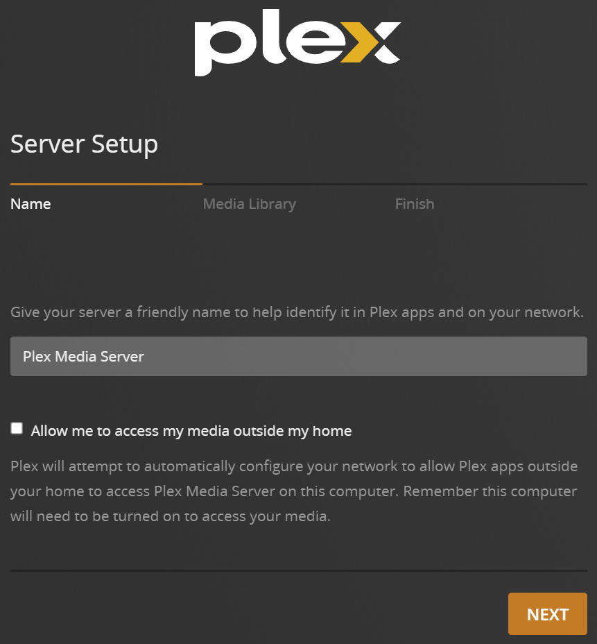
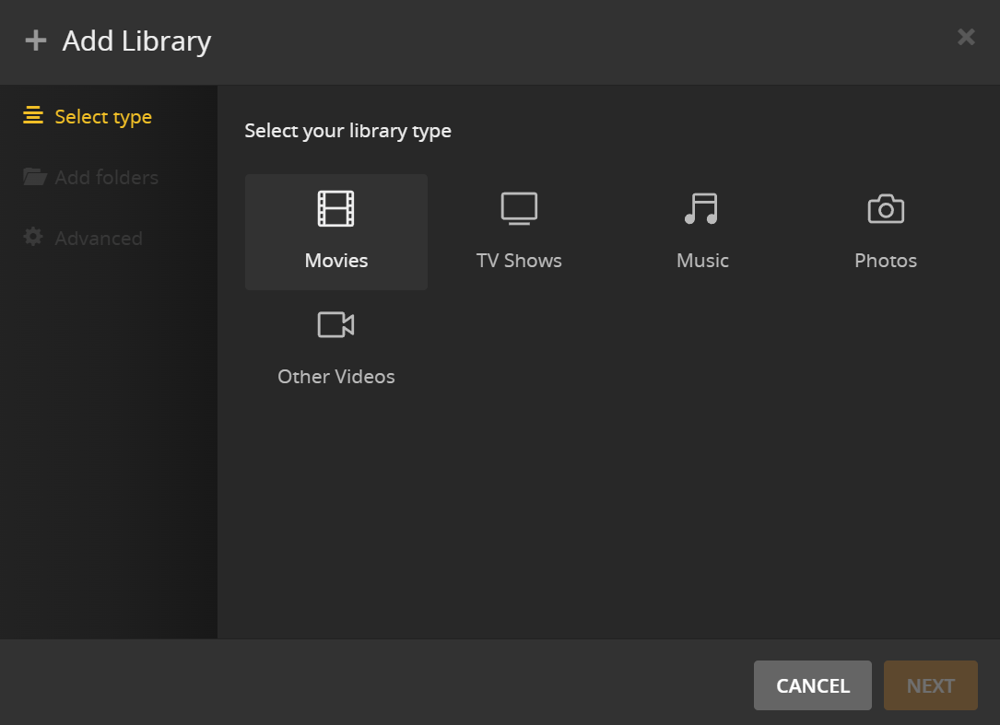
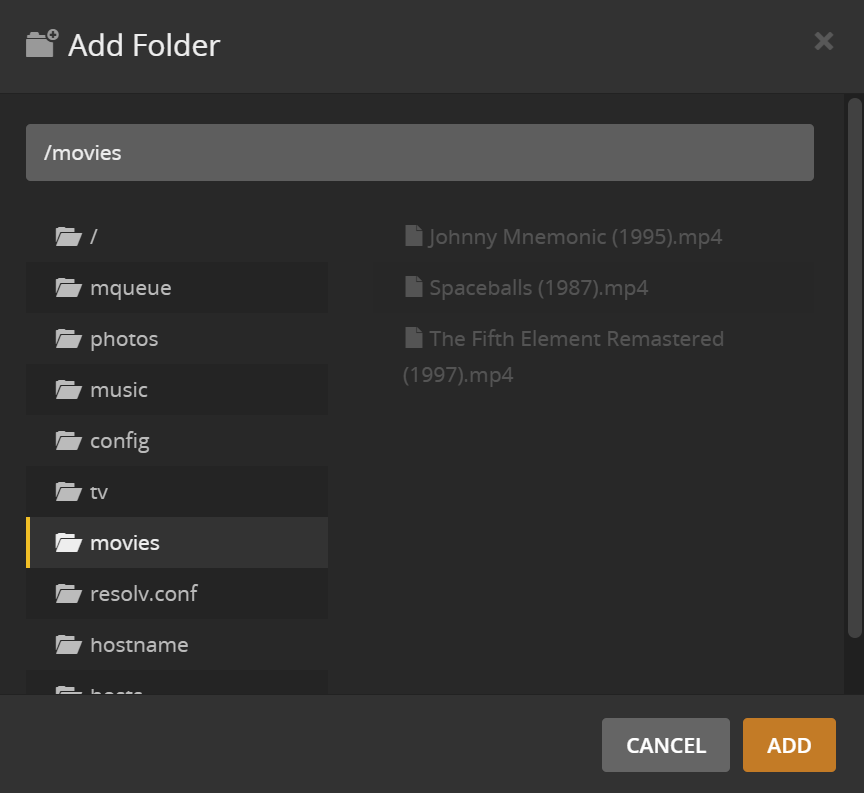

## Table of Contents

1. [Installing Docker](#install)
2. [Preparing and the Docker Compose file](#compose)
3. [Starting the container and configuring Plex](#config)
4. [References](#ref)

<div id='install'/>

## Installing Docker

In 2024, the recommended (and easiest) way to install Docker is to just run their official install script from the command line:

```bash
curl -fsSL https://get.docker.com | sh
```

This automatically installs Docker and the Compose plugin with all dependencies.

<div id='compose'/>

## Preparing the Docker Compose file

Though Plex has an <a href="https://hub.docker.com/r/plexinc/pms-docker" target="_blank">official Docker image</a>, I highly suggest you instead use the <a href="https://hub.docker.com/r/linuxserver/plex" target="_blank">Linuxserver image</a>, which is built and maintained by the <a href="https://www.linuxserver.io" target="_blank">Linuxserver community</a>. I run the Linuxserver image of Plex without issue, and it seems that is also the case with most self-hosters.

Here is an example `compose.yml` file to setup Plex:

```yaml
services:
  plex:
    image: lscr.io/linuxserver/plex:latest
    container_name: plex
    network_mode: host
    environment:
      - PUID=1000
      - PGID=1000
    ports:
    volumes:
      - ~/docker/plex:/config
      - ~/media/tv:/tv
      - ~/media/movies:/movies
      - ~/media/music:/music
      - ~/media/photos:/photos
    restart: unless-stopped
```

Let's break down what each of these parameters do:

| Paramter                   | Function                                                                                                                                                    |
| -------------------------- | ----------------------------------------------------------------------------------------------------------------------------------------------------------- |
| `image`                    | Here we're using the latest version of the Linuxserver-maintained image                                                                                     |
| `container_name`           | Optional, but you should give your containers a name for clarity                                                                                            |
| `network_mode: host`       | This is required to run Plex on Linux, but _cannot_ be used when running Plex on Windows or WSL                                                             |
| `PUID=1000`<br>`PGID=1000` | These env variable sets a UID and GID for Plex and should match the owner of the volumes you are adding; check your UID and GID with the command `id`       |
| `ports`                    | This will map ports on your machine (left of the colon) to ports inside the container (right of colon) -- optional in Linux but required in Windows and WSL |
| `volumes`                  | Here we're mapping local directories (left of the colon) to directories inside the container (right of the colon)                                           |
| `restart`                  | This tells Docker under what circumstances to restart the container when it is stopped -- the options are `no`, `always`, `on-failure` and `unless-stopped` |

<div id='config'/>

## Starting the container and configuring Plex

Once your compose file is ready, use the command `docker compose up -d` from within the same directory as the `compose.yml` to run it. After completion, use the command `sudo docker ps` to verify the container is up and running. You should see output similar to the below:

```bash
CONTAINER ID   IMAGE                             COMMAND   CREATED          STATUS          PORTS                                                                                      NAMES
8bb6d7d7786f   lscr.io/linuxserver/plex:latest   "/init"   25 seconds ago   Up 24 seconds   1900/udp, 3005/tcp, 8324/tcp, 5353/udp, 32410/udp, 32400/tcp, 32412-32414/udp, 32469/tcp   plex
```

Good to go. Now to configure Plex you'll need to access it's web UI, which by default is at (for example) `http://192.168.1.100:32400/web`. You'll be asked to login. (A <a href="https://www.plex.tv" target="_blank">Plex account</a> is required.)


After signing in, after a few explanatory pages, you'll arrive at the Server Setup page. Name your server, uncheck the checkbox unless you'll be making Plex available from outside your network (not recommended and not covered in this guide), and click _Next_.



You'll then be able to add folders with your media to the Plex library. Click the _Add Library_ button.


On the following page, you'll be able to add media directories to each Library Type. We'll use _Movies_ as an example, select it then click the _Add_ button.



Next choose the local directory from the list, in this case _movies_ (the Docker container's directory mapped to `~/media/movies`), and click \_Add.



Your movies should now appear within the _Movies_ section of the Plex UI. Repeat the process to add other directories for your _TV_, _Music_ and _Photos_ libraries. And you're done! You can now watch Plex right in the web UI, or (ideally) by downloading and signing into the Plex app on devices in your network.

<div id='ref'/>

## References

- <a href="https://linuxserver.io" target="_blank">Linuxserver</a>
- <a href="https://plex.tv" target="_blank">Plex</a>
- <a href="https://docker.com" target="_blank">Docker</a>
