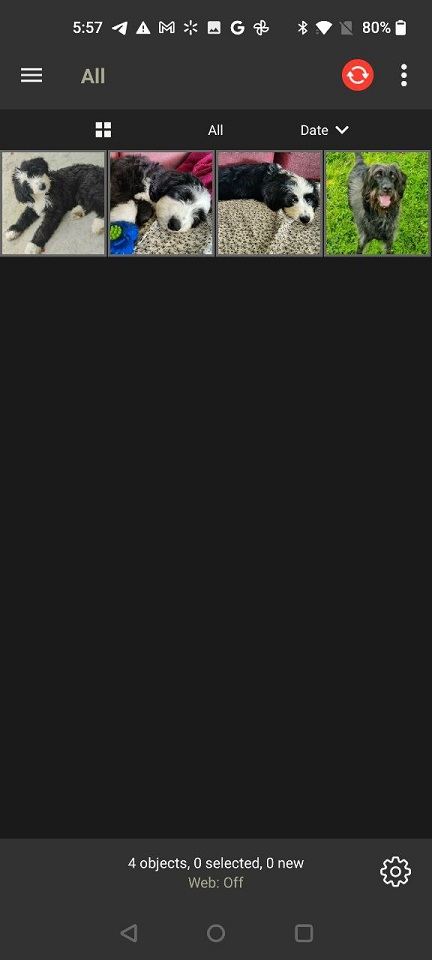
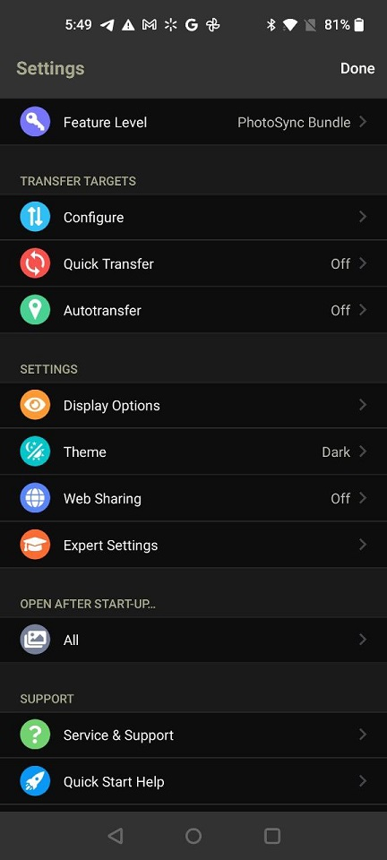
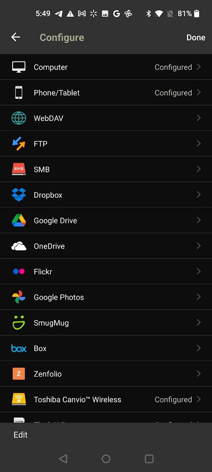
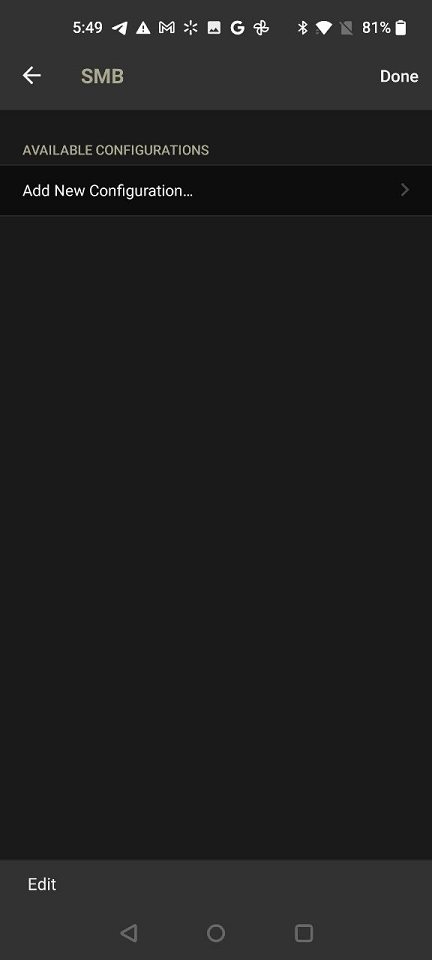
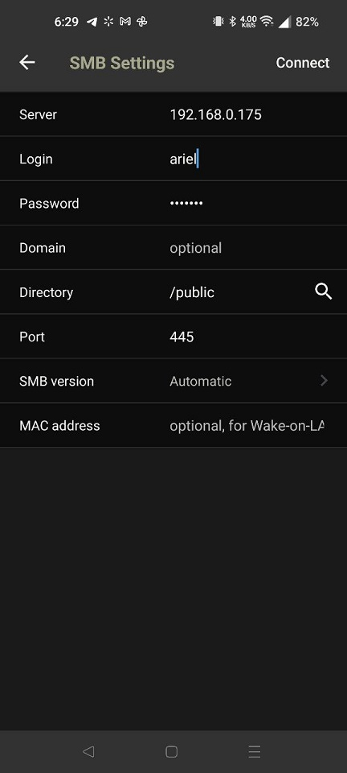
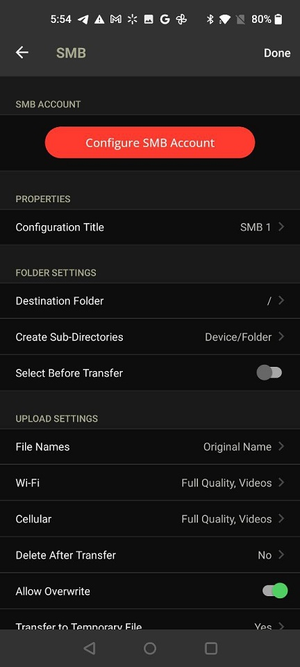
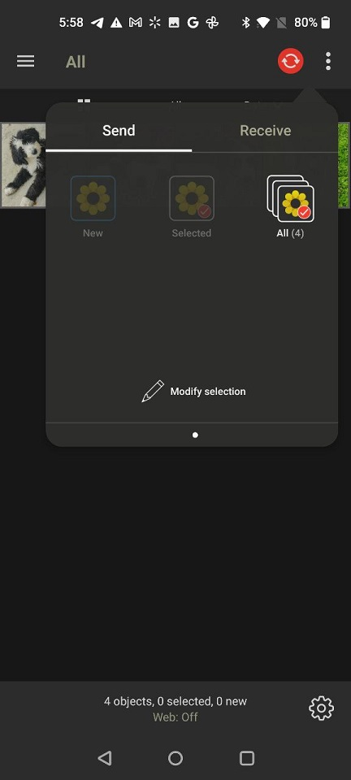
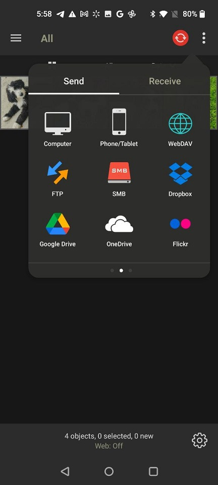
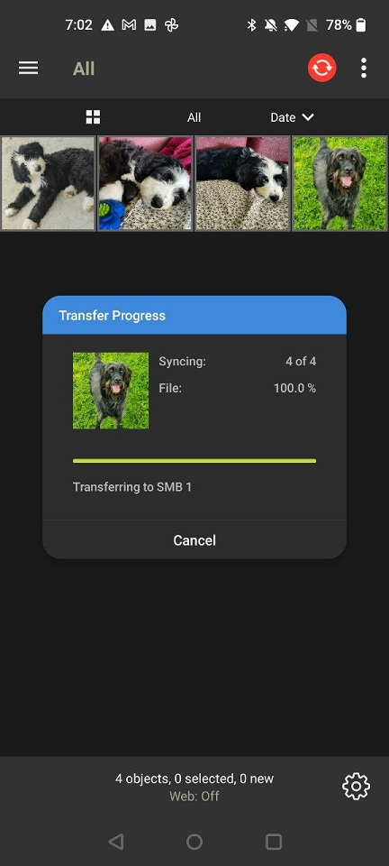

## Table of Contents

1. [Caveats and Pre-Requisites](#pre)
2. [Configure PhotoSync](#config)
3. [Transferring photos to the Samba share](#transfer)
4. [References](#ref)

  

    
      
      <b>Note</b>
    
    

      Though the <em>PhotoSync</em> app is available on iPhone as well as Android, I have an Android phone and so <em>I have only done this on Android</em>. It's safe to assume configuring PhotoSync on iPhone to connect to your NAS will be similar, if not exactly the same. Feel free to leave a comment below confirming whether or not it works on iPhone!
    

  

## Caveats and Pre-Requisites

The method I describe below requires that your phone with the PhotoSync app be connected to the same network as the server that you will be transferring your photos to, or have access to the server via a VPN or other similar solution. Also, the server must already be configured with a Samba share. (<a href="/blog/setup-a-samba-share-on-linux-via-command-line" target="_blank">See here on how to set up a Samba share on Linux.</a>)

Finally, using the SMB option to transfer photos requires the NAS Add-On for PhotoSync, which costs $2.49 by itself. (You also have the option of spending a bit more on the Bundle Add-On, which comes with the NAS Add-On as well as the Auto-Transfer and Cloud Add-Ons, but those are not necessary for this.)

## Configure PhotoSync

In the PhotoSync app, tap the _gear icon_ at the bottom-right corner to enter the Settings.

Under _Transfer Targets_ tap on _Configure_. On the following page choose _SMB_ from the list, then tap _Add New Configuration_.

Enter the IP address of the server where the Samba share is, enter the login and password (assuming you have it set up that way), then tap the _magnifying glass button next to Directory_. The app should automatically show any Samba shares already set up on the server, tap on the one you want to use. Next tap on _Connect_ at the top-right corner and if everything works correctly, you should be sent to the SMB target page.

Now under _FOLDER SETTINGS_ tap on _Destination Folder_ and pick a directory in the share, if you'd like, or just use the Share's root directory if you prefer, then tap _Select_ on the top-right.

The rest of the settings you can set to your liking. If you haven't gotten any errors, everything should be working as intended. Tap on _Done_ to return to the app's main page.

## Transferring photos to the Samba share

Back on the main page, tap the _red transfer icon at the top_, tap _All_ (or you can tap individual photos and choose _Selected_), then tap _SMB_.

Tap on the directory to transfer your photos into (keep in mind _Destination Folder_ and _Create Sub-Directories_ in the SMB Account setting from earlier) and tap Select, the photo transfer should begin.

  
    
    <b>Success!</b>
  
  

    <em>All done!</em> Now you can manually sync new photos from your phone to your NAS at any time by opening the app and repeating the last set of instructions above. <em>If you want background auto-transfers, you'll need the Auto-Transfer Add-On</em>. 
  

## References

- <a href="https://www.photosync-app.com/home" target="_blank">PhotoSync Website</a>
- <a href="/blog/setup-a-samba-share-on-linux-via-command-line">My blog post on how to set up a Samba Share
