

  

    
      
      <b>Note</b>
    
    

      I used <em>Android 12 Snow Cone</em> when making the guide, the steps to make this work may be different if you're using an older or newer version of Android. (But most likely will be the same or similar.)
    

    

      Also, this guide assumes you already have an existing SMB share accessible in your home network. If you're not sure how to set that up, <a href="/blog/setup-a-samba-share-on-linux-via-command-line" target="_blank">see this blog post for instructions</a>.
    

  

## Connect Solid Explorer to SMB share

Make sure your Android Device is connected to the same network as the machine with the SMB share. Open the Solid Explorer app and
tap the _hamburger menu_ at the top-left to bring up the menu, then tap the _3-dots_ and choose _Storage manager_.

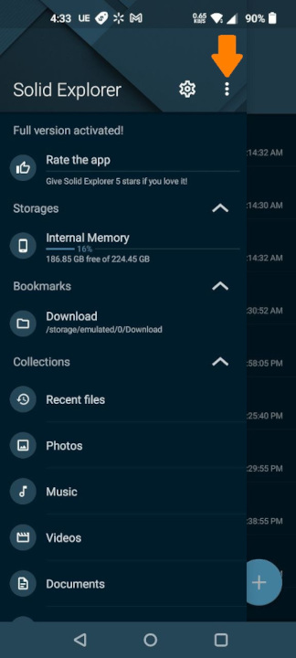
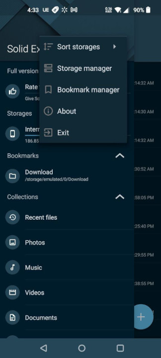

In Storage manager, tap the _Plus (+) button_ to add a new connection. In the _Network Connection Wizard_, choose _LAN / SMB_ and tap _Next_.

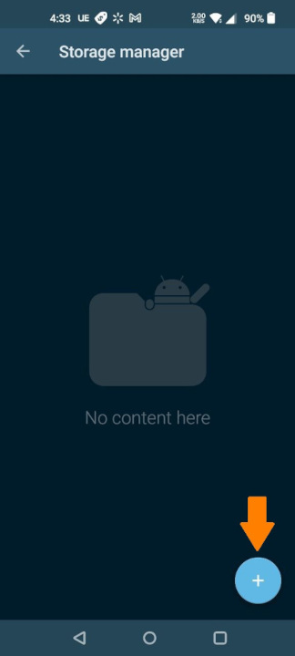
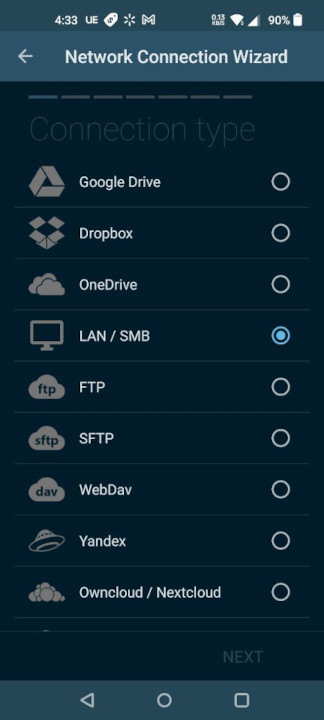

You should see any SMB shares in your network under _server details_, choose one and tap _Next_. Choose your _authentication_ method and tap _Next_. (I suggest using _Username and password_ unless you have properly configured the SMB share for guest access, otherwise you may experience permissions issues.)

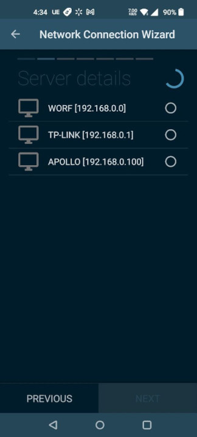
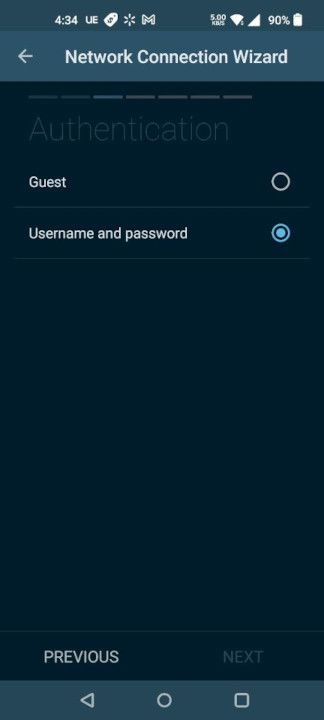

If you chose _Username and password_ authentication, you'll be prompted for the login info. Enter it and tap _Next_. On the next screen, I always choose _Yes_ to proceed to _Advanced Settings_. Tap _Next_.

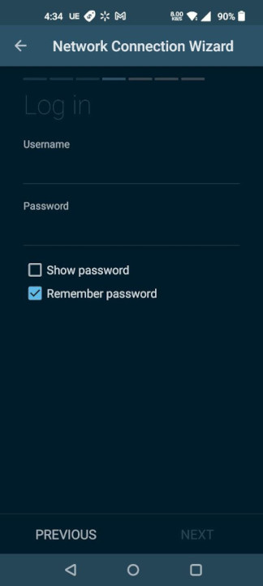
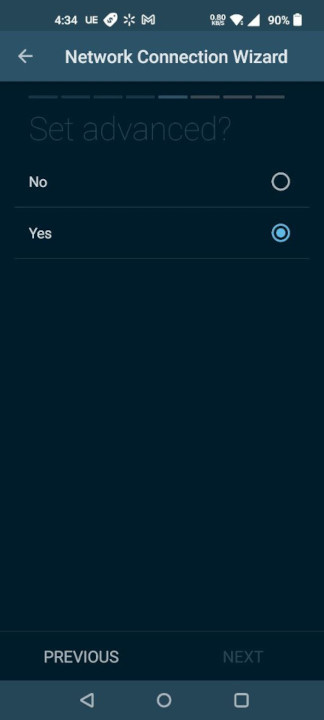

For _Protocol version_ choose the recommended _SMB 2_, then tap _Next_. You'll get to review your settings, if everything is correct tap _Next_.

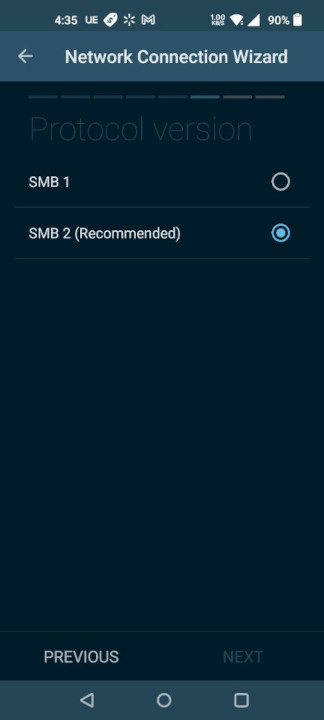
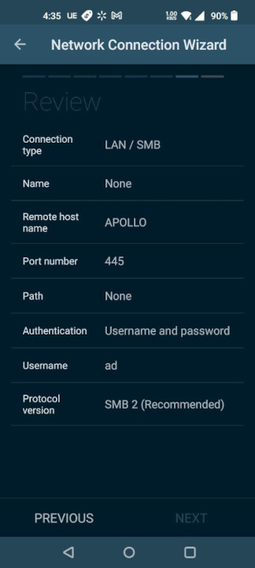

On the following screen, tap the big _Connect_ button. If everything is properly configured, the button will _turn green with a checkmark_. Tap _Finish_.

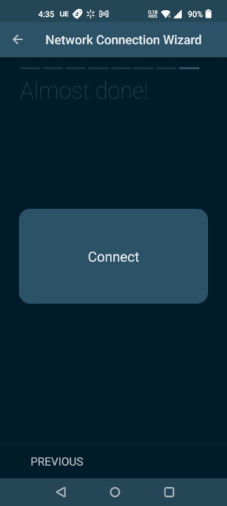
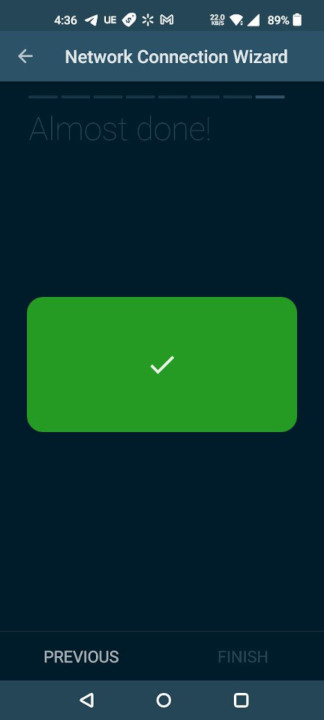

You'll see your server under _Storage manager_. Tap the _back arrow (<-)_ to go back to the menu. You should see the SMB share among the options under _Storages_.

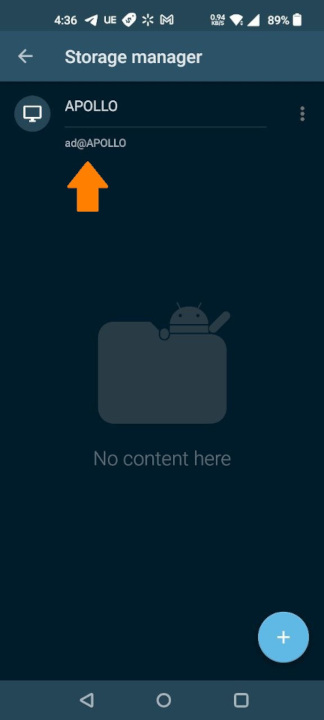
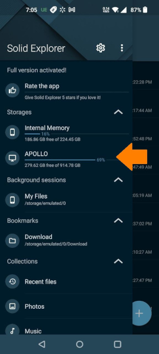

## References

- <a href="/setup-a-samba-share-on-linux-via-command-line" target="_blank">Blog post about setting up Samba share on Linux</a>
- <a href="https://play.google.com/store/apps/details?id=pl.solidexplorer2&hl=en_US&gl=US&pli=1" target="_blank">Solid Explorer on the Google Play Store</a>
