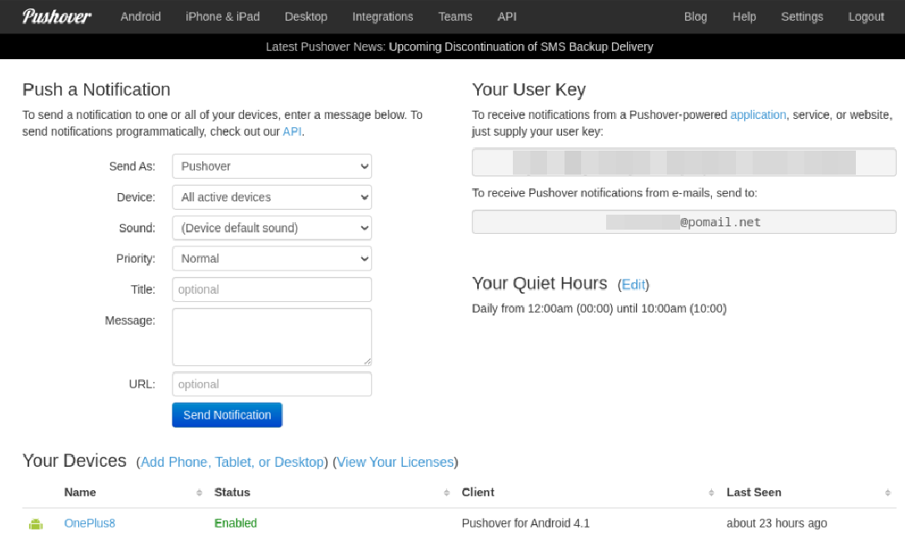
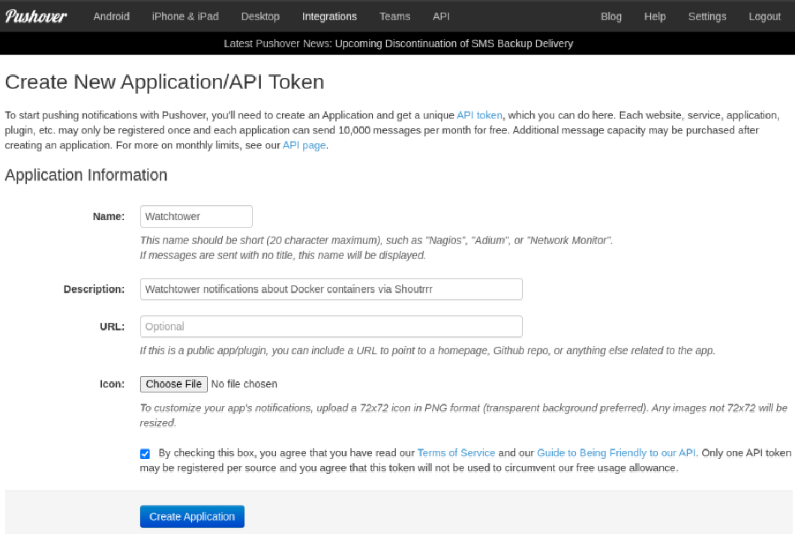
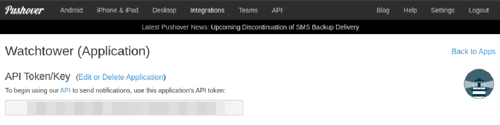
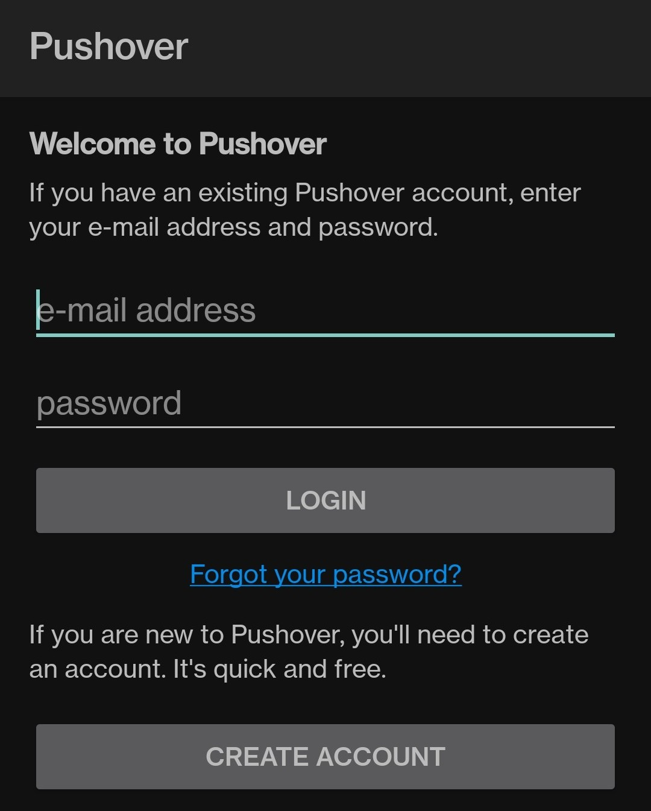
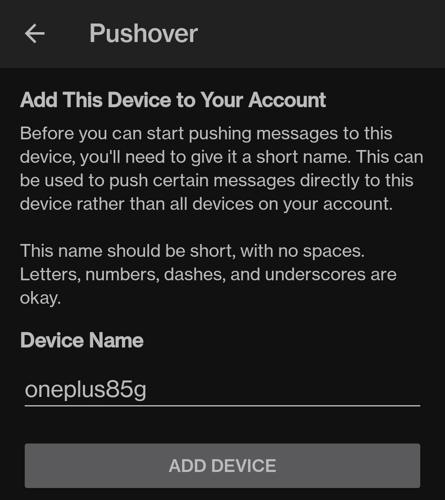
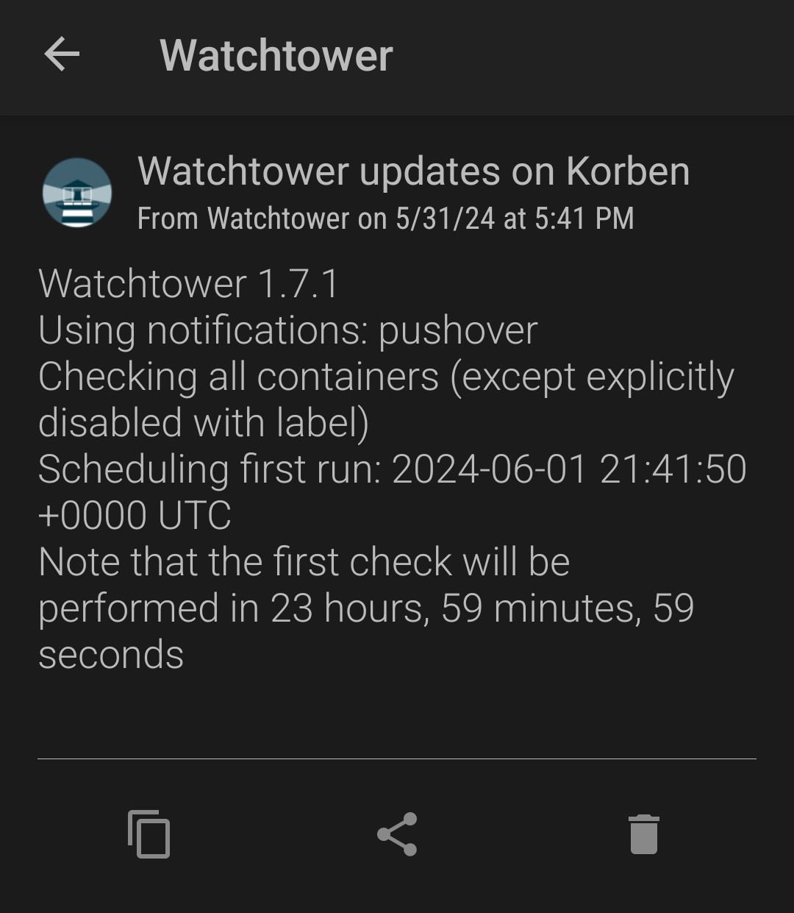
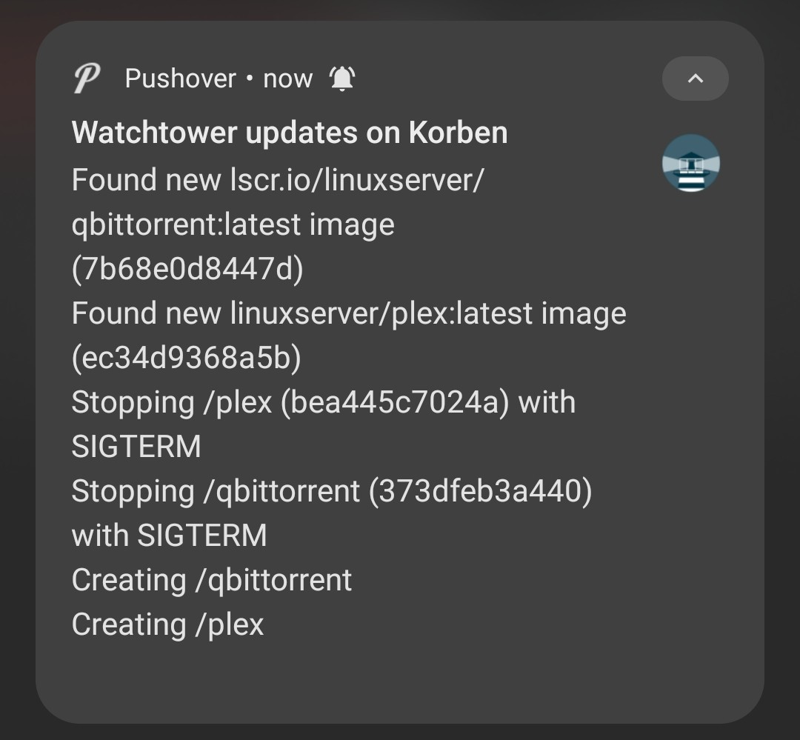

## Table of Contents

1. [About Watchtower](#about)
2. [Setting up Watchtower through Docker Compose](#setup)
3. [Notifications via Pushover (or other methods)](#notifications)
4. [References](#ref)


<div id='about'/>

## About Watchtower

<a href="https://containrrr.dev/watchtower" target="_blank">Per their own website</a>, Watchtower is a container-based solution for automating Docker container base image updates. It runs with no config, where it will automatically update any containers with a new image available, although you can configure it with all sorts of options. I strongly suggest reading the documentation to see all the available options, I will be using very specific options (which I use myself) that I will explain their use, but that won't even scratch the surface of what's capable with Watchtower.

## Setting up Watchtower through Docker Compose

I like to use Docker Compose for everything, or at least as much as possible, and I suggest you do the same. You should already have Compose if you installed the latest version of Docker, but just in case you don't, you can install it with the following command:

```bash
sudo apt install docker-compose-plugin
```

Create a `docker-compose.yml` file and paste in the below to run Watchtower with the desired options.

```yaml
services:

  watchtower:
    container_name: watchtower
    image: containrrr/watchtower
    restart: always
    volumes:
      - "/var/run/docker.sock:/var/run/docker.sock"
    environment:
      - WATCHTOWER_NOTIFICATION_URL=pushover://:ay9cv41bcpdjttmnyssy8f1v57auoo@uyks58yo5dykcnqmq52fnwv4xadf8w
      - WATCHTOWER_CLEANUP=true
      - WATCHTOWER_INCLUDE_STOPPED=true
      - WATCHTOWER_REVIVE_STOPPED=false
```
> 
>
> If you're already running other containers and want them all in the same stack (although Watchtower will monitor and update ALL containers regardless of stack, unless you specifically configure it otherwise), you can simply copy and paste the above into an existing compose file and re-run it to add Watchtower.

Here's what these environment variables do.

- `WATCHTOWER_CLEANUP=true`: This will make Watchtower delete old images once a container is updated. (You can leave this out if you prefer to use `docker prune` to delete old images.)
- `WATCHTOWER_INCLUDE_STOPPED=true`: This will cause Watchtower to update all containers, whether running or stopped, since by default Watchtower will only update running containers and ignore stopped ones.
- `WATCHTOWER_REVIVE_STOPPED=false`: This will cause Watchtower NOT to restart stopped containers after updating them (via the above), which by default it will.

At this point you can save the file and, in the same directory where the file is located, run the command `docker compose up -d` to install and run Watchtower. You're now set up to automatically shutdown, update and restart containers when a new image is available. However, what if we want to be notified when an update happens?

<div id='notifications'/>

## Notifications via Pushover (or other methods)

Watchtower has the <a href="https://github.com/containrrr/shoutrrr" target="_blank">Shoutrrr</a> libraries built-in to send notifications through several services (Discord, Telegram, Pushover, Pushbullet, Gotify just to name a few) or email (if you have SMTP set up on your server) without needing to run another container. Each service has a specific syntax to use it, and you'll need API keys or login info for the service you'll be using, so <a href="https://containrrr.dev/shoutrrr/v0.8/services/overview" target="_blank">check the documentation here</a> for details.

In my case, I use Pushover to notification to my phone, but that's just my preference -- there's many others, again just check the documentation for a full list. In case you want to use Pushover too, here's a quick how-to on setting it up.

1. Go to <a href="https://pushover.net" target="_blank">the Pushover website</a> and create a free account.

2. Once you're logged in and on the main page, you'll see your **User Key** on the right. You'll need this to set up notifications in Watchtower.



3. Scroll down to the bottom and click on **Create an Application/API token**.

4. Name the application (in this case Watchtower, or whatever you want), give it a description if you want, and optionally upload a logo. (I just used <a href="https://github.com/containrrr/watchtower/blob/main/logo.png" target="_blank">the logo from their GitHub</a>.)



5. Check the box and click the **Create Application** button.

6. Now under **Your Applications** you should see the one you just created, click on it. You'll see your **API Token/Key** which you will also need.



7. Back on the main page, click on **Add Phone, Tablet, or Desktop** and you'll see the different clients available. Pick your poison and download it from your phone's app store. (Or if you want Desktop notifications, click on that and follow the instructions.)

8. Once you've downloaded the app on your phone/tablet, open it and login with your Pushover username and password, then enter a name for the device or use the default one. This adds the device to Pushover. (If you ever want to remove the device, just logout from the app.)




Now that Pushover is set up, we'll make Watchtower use it for notifications. Per the <a href="https://containrrr.dev/shoutrrr/v0.8/services/pushover" target="_blank">Shoutrrr documentation</a>, Pushover uses the syntax `pushover://:token@user`, so you want to add this to your compose file under environment:

```yaml
  - WATCHTOWER_NOTIFICATION_URL=pushover://:<application-api-token>@<user-key>
```

One last thing, right now your notifications will come out to something like *"Watchtower updates on f712f789719e"* which is not very pretty. Let's add one more environmental variable to make our server's hostname show up instead:

```yaml
  - WATCHTOWER_NOTIFICATIONS_HOSTNAME=<hostname>
```

Your `docker-compose.yaml` file should look like this:

```yaml
  watchtower:
    container_name: watchtower
    image: containrrr/watchtower
    restart: always
    volumes:
      - "/var/run/docker.sock:/var/run/docker.sock"
    environment:
      - WATCHTOWER_NOTIFICATION_URL=pushover://:<application-api-token>@<user-key>
      - WATCHTOWER_NOTIFICATIONS_HOSTNAME=<hostname>
      - WATCHTOWER_CLEANUP=true
      - WATCHTOWER_INCLUDE_STOPPED=true
      - WATCHTOWER_REVIVE_STOPPED=false
```

Use `docker compose up -d` again to update the container. Once it's up and running, you should get a notification from Pushover that looks like this (with the hostname you set, in the example below it shows my server's hostname):



In the future, any updates will result in a notification specifying which containers were updated and restarted, for example:



All done! You should now get notifications through Pushover each time Watchtower updates any container images. If you want to use a different service for notifications, simply check <a href="https://containrrr.dev/shoutrrr/v0.8/services/overview" target="_blank">the Shoutrrr documentation for the syntax</a> and use that instead. You can even customize the 

## Related Articles

> [Setup self-hosted Plex Media Server in Docker](/blog/setting-up-plex-in-docker)

> [How to run self-hosted FileBrowser in Docker](/blog/how-to-run-filebrowser-in-docker)

<div id='ref'/>

## References

- <a href="https://containrrr.dev/watchtower" target="_blank">Watchtower Documentation</a>
- <a href="https://github.com/containrrr/watchtower" target="_blank">Watchtower GitHub</a>
- <a href="https://containrrr.dev/shoutrrr" target="_blank">Shoutrrr Documentation</a>
- <a href="https://github.com/containrrr/shoutrrr" target="_blank">Shoutrrr GitHub</a>
