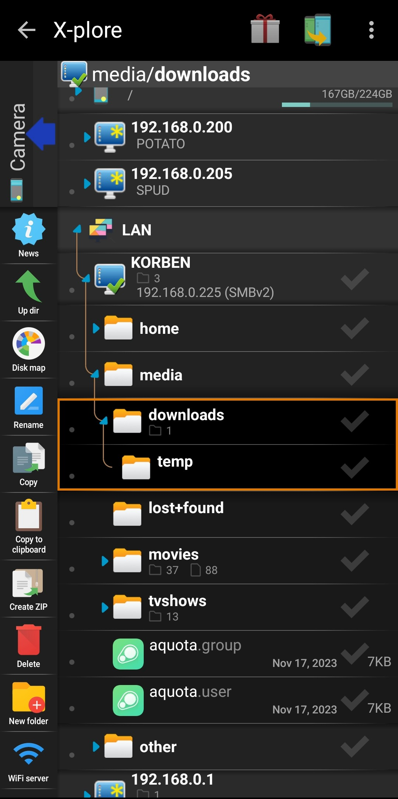

## Sections

1. [Adding SMB share in X-plorer](#add)
2. [Transferring files from Android to SMB share](#transfer)
3. [References](#ref)

> 
>
> Although I'm doing this on a OnePlus phone running **OxygenOS 13**, it is just a customized version of **Android 13** -- Everything below should work on any version of Android 13, and probably older versions as well.

## Adding SMB share in X-plorer

I previously [wrote about using Solid Explorer as a file manager on Android](/blog/solid-explorer-samba-share/), and while I prefer it for accessing and consuming content from SMB shares (documents, photos, music, videos, etc.), I find the UI for file transfers kind of annoying compared to _X-plore File Manager_.

First, make sure you're on the same Wi-Fi network as the SMB share you want to add. (Setting this up to be available from outside the home network is possible, but beyond the scope of this article.) X-plore File Manager's UI looks weird at first, but once it clicks for you it's very easy to use. When you first open it will show your internal storage.

If you swipe left from here, or click the icon to the left of the three-dot menu, the screen will change to a second, identical screen. On this second screen, tap on **Internal shared storage** to close it, you'll see other options.

The option we want is **LAN**. Tap on it, then on **Add serser**, and from the dropdown **Scan**. This will show any discoverable network shares.

Click on the share you want to access, if login is required you'll get a pop-up asking for login info. Add your username and password and click **Save**.

Now you'll be back in the list of discovered SMB share, notice the one you just added moved to the top of the list under LAN has a **checkmark on the icon**.

Tap the server and it will show all available shares.

## Transferring files from Android to SMB share

We will now transfer multiple files from the Android device to a network share on my server. Swipe back to the phone's internal storage, tap to a folder with files you want to transfer -- say, **DCIM** -> **Camera** for example.

To select specific files, tap the **checkmarks** next to the files. Alternately, you can tap the checkmark next to a folder to select the folder with all contents, or tap the checkmark twice to select all files inside the folder.

Once you've selected what you want to transfer, swipe back to **LAN** storage, tap the server and find the folder you want to transfer files into from Android -- tap the **checkmark** next to that folder.

Now swipe back to internal storage, tap and hold one of the selected files to bring up a menu. Tap on **Copy**.

You'll get a final confirmation dialog, and the option to move instead of copy the files, which will delete the source files. Tap **OK**.

You'll see the files being transferred...

And then they'll be in your destination folder in the network share.

All done! Once you get a hang of the UI, transferring files back and forth from Android to remote sources is very easy. You can also use other means besides SMB, including (but not limited to) FTP and SSH, cloud storage like Google Drive or Dropbox, etc. Overall, I think **X-plore** is a great file manager for Android.

## Related Articles

> [Setup a Samba share on Linux via command line](/blog/setup-a-samba-share-on-linux-via-command-line/)

> [How to use Solid Explorer app to access SMB network shares from an Android device](/blog/solid-explorer-samba-share/)

## References

- <a href="https://www.lonelycatgames.com/apps/xplore" target="_blank">X-plore website</a>
- <a href="https://play.google.com/store/apps/details?id=com.lonelycatgames.Xplore" target="_blank">Download X-plore on Google Play</a>
- <a href="https://www.amazon.com/Lonely-Cat-Games-X-plore-Manager/dp/B00LLG7AR8" target="_blank">Download X-plore on Amazon Appstore</a>
