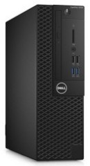

## Dell Optiplex 3050 SFF

- Intel Core i5-6500 @ 3.60 GHz
- 16 GB RAM
- 256 GB PCIe M.2 NVMe SSD (Boot drive)
- 1 TB Internal 2.5" HDD
- 1 Gbps Ethernet

Bought on EBay for around $160. Added a cheap, low capacity NVMe SSD to use as a boot drive and replaced the CD drive with a caddy that holds a laptop hard drive. I originally used this as my home server, but switched over to using <a href="/wiki/korben/">my Dell Optiplex 3020 Micro</a> as the server, and currently <a href="/wiki/athena/">my old Dell PC</a> is my server.

This machine was my daily driver for over a year, running Debian 12 (later 13) and KDE Plasma desktop environment. It was mostly okay, but it did start chugging if I had too many Chrome tabs open, which I tend to do. I have recently upgraded to using [Bazzite on my wife's old Dell XPS 8920](/wiki/artemis/). (An upgrade from this.)