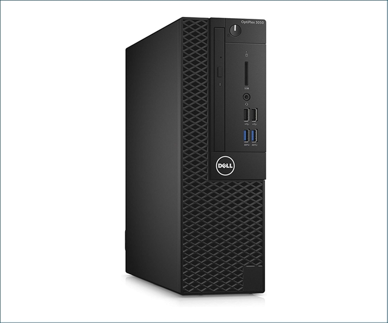

# Dell Optiplex 3050 SFF

- **IP**: 192.168.0.100
- Intel Core i5-6500 @ 3.60 GHz
- 256 GB PCIe M.2 NVMe SSD (Boot drive)
- 1 TB 3.5" Internal HDD
- 1 TB 2.5" Internal HDD
- 1 Gbps Ethernet
- 16 GB RAM

Bought on EBay for around $160. Added a cheap, low capacity NVMe SSD to use as a boot drive, a 1 TB full-size (2.5") hard drive, and replaced the CD drive with a caddy that holds a laptop hard drive (2.5"). I originally used this as my home server, but switched over to using <a href="korben">my Dell Optiplex 3020 Micro</a> as the server, and currently <a href="athena">my old PC</a> is my server.

I currently use this machine as my daily driver since it has an HDMI port (the 3020 micro does not), running Debian 12 and XFCE desktop environment. It's has much lower power consumption than my Windows PC, so I only use the Windows PC for gaming, and use this for everything else.
