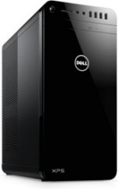

## Dell XPS 8920

- **Intel i7-7700K** @ 4.20 GHz
- **24 GB RAM** (4 x 6 GB DDR4)
- **AMD Radeon RX 480 GPU**
- **256 GB PCIe M.2 NVMe SSD** (boot drive)
- 1 x **1 TB Internal 3.5" HDD**
- 1 x **500 GB Internal 2.5" HDD**
- 1 x **1 Gbps Ethernet**

My wife's former daily driver PC running Windows 10 since 2015, the twin of what is now [my home server, Athena](/wiki/athena/). She upgraded to a new gaming laptop and this sat in a corner forgotten for a year before she let me take it over. It's running Bazzite.