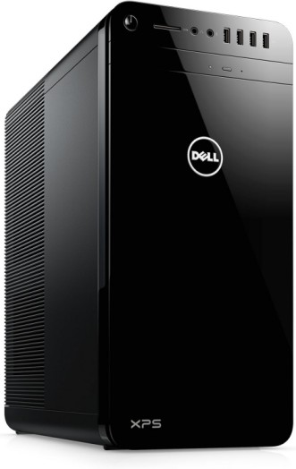

> See <a href="/blog/how-i-setup-home-server/" target="_blank" data-umami-event="wiki-athena-home-server-blog">this blog post</a> for more details.

# Dell XPS 8920 

- **Intel i7-7700K** @ 4.20 GHz
- **24 GB RAM** (4 x 6 GB DDR4)
- **256 GB PCIe M.2 NVMe SSD** (boot drive)
- 2 x **4 TB Internal 3.5" HDD** (large media storage)
- 3 x **2 TB Internal 3.5" HDD** (large media storage)
- 1 x **1 TB External 3.5" HDD** (documents, ebooks, photos)
- 1 x **1 TB External 2.5" HDD** (backups)
- 3 x **1 Gbps Ethernet** (extra 2 port NIC -- unused)

## Information

My former daily driver desktop PC since 2015, where I interneted, gamed and worked. This thing was still trucking on Windows 10 in 2024 and with the stock AMD Radeon RX 480 GPU was still playing newer games like Cyberpunk 2077 very well. When I got a new gaming PC, I decided to turn this one into a server.

I removed the GPU since Plex cannot use AMD cards for transcoding (at least not well) and the integrated GPU can do Intel Sync and transcodes perfectly. It's a moot point anyway since I rarely have to transcode anything. I installed Debian on the M.2 NVMe drive and moved over all my HDDs from my old server, but this time they could be internal since the motherboard has 4 SATA ports.

## Details

The operating system is Debian 12 with no desktop environment. Cockpit is installed for managing the server through a GUI. Tailscale is installed bare metal for connecting with phone and tablet from outside my home network, and with a remote <a href="https://www.oracle.com/cloud/free" target="_blank">Oracle Cloud Free Tier</a> compute instance. (<a href="/blog/expose-plex-tailscale-vps/" target="_blank">See here</a> for details.) Most self-hosted apps and services are run on this server via Docker containers. Three HDDs of 2 TB capacity each plus one 4 TB HDD are used for large media storage, mounted at `/mnt/media1`, `/mnt/media2`, etc. MergerFS provides a unified mount point at `/home/$USER/media` which is what Plex accesses to populate the media library. An additiona 1 TB HDD holds all my documents, photos and music and is backed up to an external 1 TB laptop drive in a USB 3.0 enclosure.

## Containers

- Filebrowser
- Gluetun
- Home Assistant
- IT Tools
- Kavita
- LibrePhotos
- Mosquitto
- Nginx Proxy Manager
- Opengist
- Paperless
- Plex
- Portainer
- qBittorrent
- Scrutiny
- Speedtest Tracker
- Stirling PDF
- Syncthing
- Tautulli
- Uptime Kuma
- Watchtower