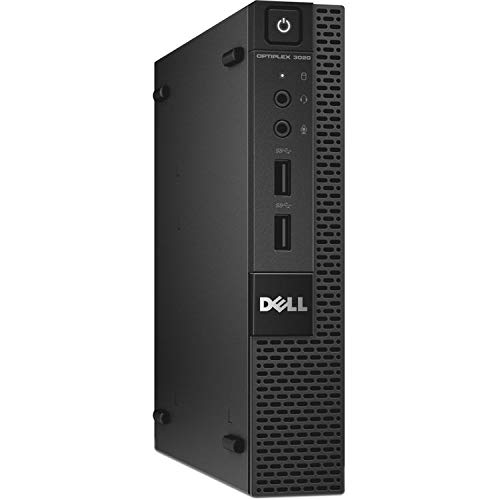

# Dell Optiplex 3020 Micro

- **IP**: 192.168.0.225
- Intel Pentium G3250T CPU @ 2.8 GHz
- 120 GB 2.5" Internal HDD
- 1 Gbps Ethernet
- 8 GB RAM

## Information

Bought on EBay for $45. It came with a small laptop-sized 2.5" internal HDD (the only kind that fits) that has been trucking without issues for several years. It runs Proxmox, which I use once in a blue moon for testing stuff in VMs.
