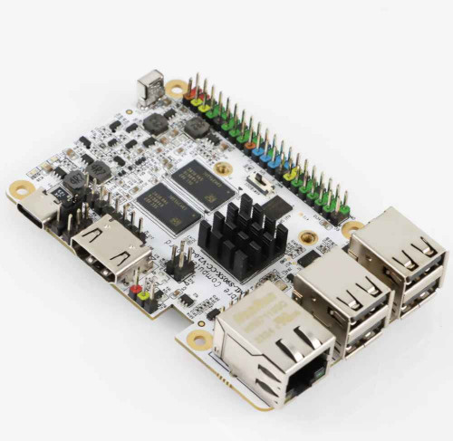

# Libre Sweet Potato

- **IP**: 192.168.0.205
- 32 GB USB Drive (boot drive)
- 100 Mbps Ethernet

## Information

Bought for $35 from Amazon. Sips power and acts as my backup Pi-Hole. Mostly off and unused at the moment.
