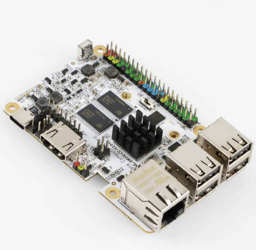

# Libre Sweet Potato

- 1.4 GHz CPU
- 2 GB RAM
- 16 MB eMMC (unused)
- 32 GB USB Drive (boot drive)
- 64 GB USB Drive (game storage)
- 100 Mbps Ethernet

Bought for $35 from Amazon. Runs **EmuELEC**, acts as a retro game console. (NES, SNES, GBA, PSX, N64.)