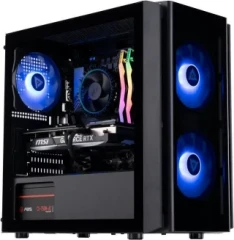
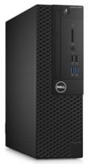
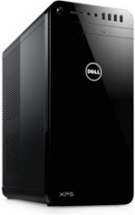

:::div{.img-left}

:::

## [ABD Flux Aqua Gaming PC](https://www.newegg.com/abs-flux-aqua-gaming-desktop-geforce-rtx-4070-super-intel-core-i5-14400f-32gb-ddr5-1tb-pcie-ssd-fa14400f4070s/p/N82E16883360471?Item=N82E16883360471)

<h4 class="inv">Power hungry beast used exclusively for gaming</h4>

- **Windows 11 Home**
- Gigabyte B760M C Motherboard
- Intel Core i5-14400F @ 2.50 GHz
- Nvidia GeForce RTX 4070 SUPER
- 32 GB DDR5 RAM (2 x 16 GB, 2 free DIMM)
- 1 TB NVMe SSD
- 1 TB SATA SSD
- 1 TB SATA HDD
- 1 Gbps Ethernet
    

:::div{.img-left}

:::

## Dell Optiplex 3050 SFF

<h4 class="inv">Former home server now used as daily driver</h4>

- **Debian 13 Trixie w/ KDE Plasma**
- Intel Core i5-6500 @ 3.60 GHz
- 16 GB DDR4 RAM (2 x 8GB)
- 256 GB NVMe SSD
- 1 TB SATA HDD
- 1 Gbps Ethernet
    

:::div{.img-left}

:::

## Dell XPS 8920

<h4 class="inv">Former PC turned home server</h4>

- **Debian 13 Trixie**
- Intel i7-7700K CPU @ 4.20 GHz
- 24 GB DDR4 RAM (4 x 6 GB)
- 250 GB NVMe SSD
- 3 x 4 TB HDDs
- 4 x 2 TB HDDs
- 2 x 1 TB HDDs
- 3 x 1 Gbps Ethernet Ports (only one used though)
    

## Software

- On Linux, [Zsh](https://zsh.org/) with [Oh-My-Zsh](https://ohmyz.sh/)
- On Windows, [Terminal](https://github.com/microsoft/terminal) with [Oh-My-Posh](https://ohmyposh.dev/)
- [Visual Studio Code](https://code.visualstudio.com/)
- [Obsidian](https://obsidian.md/) for notes

## Network Gear

- [GL.iNet Flint 2 Router](https://www.gl-inet.com/products/gl-mt6000/)
- [TP-Link Archer AX55/AX3000](https://www.tp-link.com/us/home-networking/wifi-router/archer-ax3000/) (used as wired ethernet switch only)
- [Netgear GS108E 8-port Managed Switch](https://www.netgear.com/business/wired/switches/easy-smart/gs308e/)

## Smart Home

- [Bond Bridge](https://bondhome.io/product/bond-bridge)
- [SONOFF Zigbee 3.0 USB Dongle Plus](https://sonoff.tech/en-us/products/sonoff-zigbee-3-0-usb-dongle-plus-zbdongle-p?srsltid=AfmBOoqHWavyjm16ekiDbe28nAmIuRTiAu8urxdPkSBd_ULziZQXECUZ)
- [Shelly Plus Plugs US](https://us.shelly.com/products/shelly-plus-plug-us?srsltid=AfmBOopBfPQ1dV8jQexeoiMfCIB6nfW-4mKYdci3zmG_cATVfaeNV4LX)
- [Gosund WP3 Smart Plugs](http://www.gosund.net/#/detail?detId=7)
- [Kasa KP125M Smart Plugs](https://www.kasasmart.com/us/products/smart-plugs/kasa-smart-plug-slim-energy-monitoring-kp125m)
- [Kasa HS200-2 Smart Light Switches](https://www.kasasmart.com/us/products/smart-switches/kasa-smart-wi-fi-light-switch-hs220-2)
- [Kasa KL135 Smart Light Bulbs](https://www.kasasmart.com/us/products/smart-lighting/kasa-smart-light-bulb-multicolor-kl135)
- [GE Cync A19 Smart Light Bulbs](https://www.gelighting.com/led-lights/bulbs/medium-base/ge-cync-smart-led-light-bulb-color-changing-matter-compatible)
- [Google Nest Wired Doorbell 2nd Gen](https://www.amazon.com/Google-Nest-Doorbell-Wired-2nd/dp/B0BBSLG6PC?th=1)
- [Google Nest Learning Thermostat 3rd Gen](https://www.amazon.com/Google-Nest-Learning-Thermostat-Programmable/dp/B0DZDB98JG)
- [Google Nest Mini Speakers](https://store.google.com/product/google_nest_mini?hl=en-US)
- [Carro Espear 60" Smart Ceiling Fan](https://carrousa.com/products/espear-60-inch-5-blade-smart-ceiling-fan-with-led-light-kit-remote-white-white?variant=42178767618182)
- [Home Decorators Collection Triplex 60" Smart Ceiling Fan](https://www.homedepot.com/p/Home-Decorators-Collection-Triplex-60-in-LED-Brushed-Bronze-Ceiling-Fan-with-Light-YG749-BRB/307266742)
